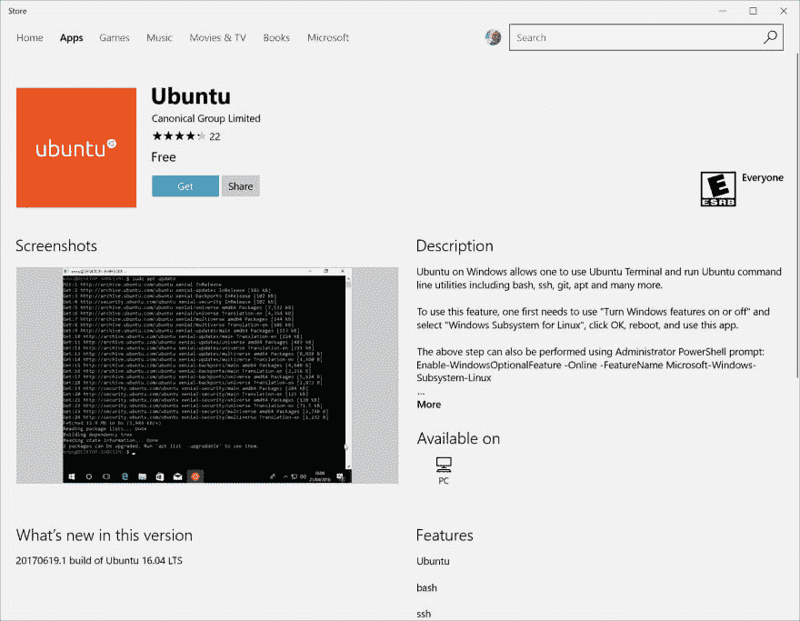
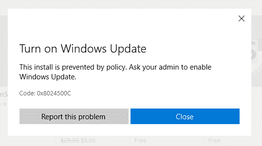

# Windows 10 上用于 Linux 的 Windows 子系统(WSL)

> 原文：<https://dev.to/harshadranganathan/windows-subsytem-for-linux-wsl-on-windows-10-4fi>

WSL 是在 Windows 10 Fall Creators Update 及更高版本(Windows build 16215 或更高版本)中引入的。

## 先决条件

以管理员身份运行`PowerShell`中的以下命令，确保“Windows Subsystem for Linux”功能已启用。

```
Enable-WindowsOptionalFeature -Online -FeatureName Microsoft-Windows-Subsystem-Linux 
```

您也可以通过勾选`Windows Subsystem for Linux`通过`Turn Windows features on or off`控制面板选项启用它。

## 安装 Linux 发行版

1.  打开微软商店，选择您喜欢的 Linux 发行版。
2.  从发行版的页面中，选择“Get”来安装发行版。

[](https://rharshad.com/assets/img/2019/03/ubuntu-windows-store.png)

如果您的公司策略禁止从 Microsoft store 安装，您可能会得到以下错误。

在这种情况下，[下载](https://docs.microsoft.com/en-us/windows/wsl/install-manual)发行版并手动安装它们。

[](https://rharshad.com/assets/img/2019/03/ubuntu-windows-store-install-error.png)

运行。由于公司策略，appx 文件仍将失败。要解决这个问题，请遵循以下步骤:

1.  重命名的扩展名。appx 文件到. zip。
2.  提取所有内容。
3.  运行。exe 文件放在提取的文件夹中。

安装完成后，将要求您创建一个新的用户帐户，并输入密码。

当你启动你的发行版时，你不会被要求输入密码，除非你使用`sudo`提升你的权限。

## 升级发行版

Windows 不会自动更新或升级您的 Linux 发行版。在 Debian/Ubuntu 上，你可以使用 apt 来升级软件包:

```
sudo apt update && sudo apt upgrade 
```

## 推出发行版

您可以通过多种方式启动发行版:

1.  从 windows 应用商店启动
2.  从命令提示符`wsl [command]`运行 wsl 命令
3.  运行 wsl.exe，允许您管理您的发行版，设置默认发行版和卸载发行版。

## 重装发行版

如果你手动删除 ubuntu 文件夹并启动 WSL，你会得到一个错误`0x80070003`。当您安装发行版的路径不存在/被删除/移除时，就会出现这种情况。例如，当您将发行版文件夹移动到 C:驱动器时。

在这种情况下，您必须注销发行版并重新安装它。

列出 WSL 可用的发行版:

```
C:\Users\harshad>wslconfig.exe /l
Windows Subsystem for Linux Distributions:
Ubuntu-18.04 (Default) 
```

用发行版名称注销发行版:

```
C:\Users\harshad>wslconfig.exe /u Ubuntu-18.04 
```

再次重新安装发行版。

## 改变挂载路径

WSL 在 Linux 发行版的`/mnt/<drive>`文件夹下挂载你机器的硬盘。

要将挂载路径更改为`/`，这样您就不必在每次运行 wsl 时都将目录更改为您的驱动器，请创建一个`wsl.conf`文件。

```
sudo nano /etc/wsl.conf 
```

粘贴以下内容并保存。下次重新启动时，更改应该会反映出来。

```
[automount]
root = /
options = "metadata" 
```

## 安装 Docker

要在 WSL 中安装 docker 和 docker compose，请运行以下脚本:

```
set -e

# Update package lists
echo "# Updating package lists"
sudo apt-add-repository -y ppa:git-core/ppa
sudo apt-get update

# Ensure that CA certificates are installed
sudo apt-get -y install apt-transport-https ca-certificates

# Add Docker repository key to APT keychain
curl -fsSL https://download.docker.com/linux/ubuntu/gpg | sudo apt-key add -

# Update where APT will search for Docker Packages
echo "deb [arch=amd64] https://download.docker.com/linux/ubuntu ${CODENAME} stable" | \
    sudo tee /etc/apt/sources.list.d/docker.list

# Update package lists
sudo apt-get update

# Verifies APT is pulling from the correct Repository
sudo apt-cache policy docker-ce

# Install Docker
echo "# Installing Docker"
sudo apt-get -y install docker-ce

# Add user account to the docker group
sudo usermod -aG docker $(whoami)

# Install docker compose
echo "# Installing Docker-Compose"
sudo curl -L "https://github.com/docker/compose/releases/download/1.13.0/docker-compose-$(uname -s)-$(uname -m)" \
    -o /usr/local/bin/docker-compose
sudo chmod +x /usr/local/bin/docker-compose

# Print installation details for user
echo ''
echo 'Installation completed, versions installed are:'
echo ''
echo -n 'Docker: '
docker --version
echo -n 'Docker Compose: '
docker-compose --version

# Print reminder of need to logout in order for these changes to take effect!
echo ''
echo "Please logout then login before continuing." 
```

在您的`Docker for Windows`设置中启用`Expose daemon on tcp://localhost:2375 without TLS`。

然后我们配置 WSL 连接到运行在`Docker for Windows`中的远程 docker 守护进程。

```
echo "export DOCKER_HOST=tcp://localhost:2375" >> ~/.bashrc && source ~/.bashrc 
```

然后，我们在 WSL 中运行 docker 命令。

## 安装 Git，节点& Python

```
# Exit on any failure
set -e

# Update package lists
echo "# Updating package lists"
sudo apt-add-repository -y ppa:git-core/ppa
sudo apt-get update

# Install Git
echo "# Installing Git"
sudo apt-get install -y git

# Install nvm dependencies
echo "# Installing nvm dependencies"
sudo apt-get -y install build-essential libssl-dev

# Execute nvm installation script
echo "# Executing nvm installation script"
curl -o- https://raw.githubusercontent.com/creationix/nvm/v0.33.2/install.sh | bash

# Set up nvm environment without restarting the shell
export NVM_DIR="${HOME}/.nvm"
[-s "${NVM_DIR}/nvm.sh"] && . "${NVM_DIR}/nvm.sh"
[-s "${NVM_DIR}/bash_completion"] && . "${NVM_DIR}/bash_completion"

# Install node
echo "# Installing nodeJS"
nvm install 8
nvm use 8

# Ensure that CA certificates are installed
sudo apt-get -y install apt-transport-https ca-certificates

# Install python v2 if required
set +e
COUNT="$(python -V 2>&1 | grep -c 2.)"
if [${COUNT} -ne 1]
then sudo apt-get install -y python-minimal
fi

# Print installation details for user
echo ''
echo 'Installation completed, versions installed are:'
echo ''
echo -n 'Node: '
node --version
echo -n 'npm: '
npm --version
echo -n 'Python: '
python -V

# Print reminder of need to logout in order for these changes to take effect!
echo ''
echo "Please logout then login before continuing." 
```

## 参考文献

[https://docs.microsoft.com/en-us/windows/wsl/about](https://docs.microsoft.com/en-us/windows/wsl/about)