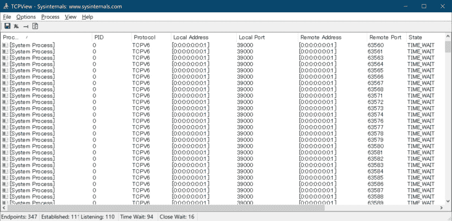
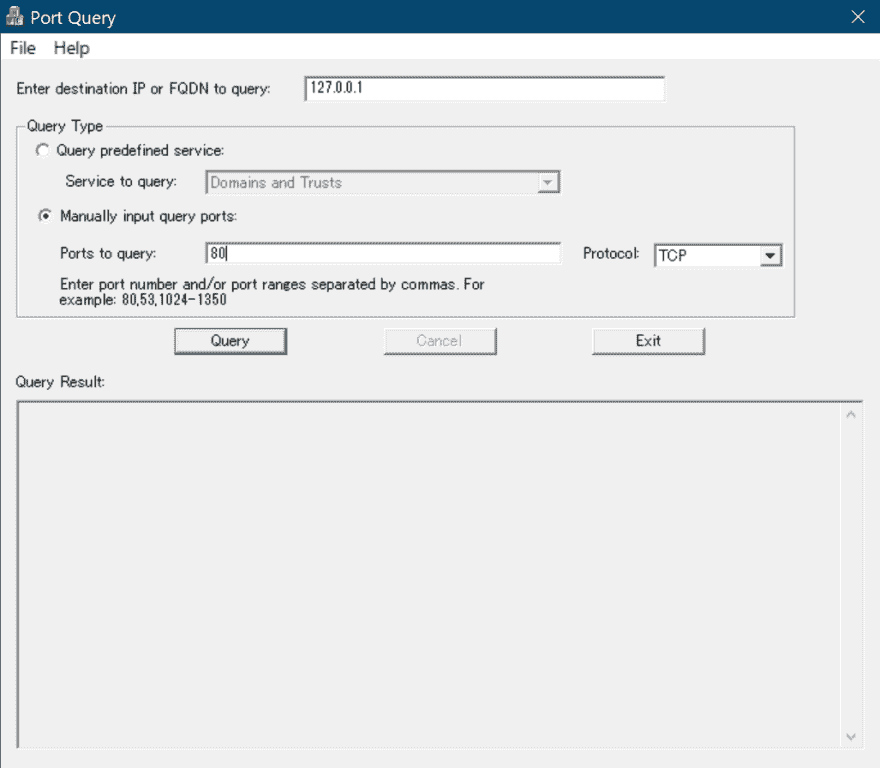

# 在 Windwos 上调查 TCP/UDP 的方便工具

> 原文：<https://dev.to/shiena/windwos-tcp-udp-57ce>

# 前言

请注意，有一个 MS 工具可以检查在 Windows 上快速打开 TCP 端口的过程，或检查 TCP/UDP 端口是否在任何主机上打开。

# 用于 Windows 的 TCP 视图

【Windows 的 TCP 视图

# [端口 QR/端口查询](#portqry-portqueryui)

[端口 QR/端口查询](https://support.microsoft.com/ja-jp/help/310099/description-of-the-portqry-exe-command-line-utility)

链接目的地有 CUI 的 PortqryV2 和 GUI 包装器的 PortQueryUI。

