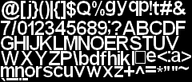
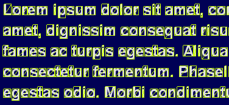

# 我的新图书馆

> 原文：<https://dev.to/reg__/winfontrender---my-new-library-3di4>

显示文本是图形应用程序中的一个常见问题，在图形应用程序中，您所能做的就是渲染纹理四边形。早在 2007 年，我就已经实现了我的解决方案，作为我的旧引擎[最终任务 7](http://asawicki.info/productions/gry/TFQ_Source.php5) 的一部分，那是我的硕士论文。我最近回到这段代码并对它进行了改进，因为我现在从事的个人项目需要它。然后我想:也许把这段代码提取到一个库中是个好主意？这就是:

[**WinFontRender——在图形应用中渲染 Windows 字体的小型单头 C++库**](https://github.com/sawickiap/WinFontRender)

它做两件事:

1.  它将字体中的字符呈现为一种紧密包装的纹理。

1.  它计算渲染给定文本所需的顶点。

以下是关于该库的更多详细信息:

*   许可证基于麻省理工学院，所以它可以免费使用，即使是在一个专有的，闭源软件。
*   独立，单个文件，易于与您的项目集成。
*   用 C++写的。只依赖于 STL 和 WinAPI。
*   与图形 API 无关。返回纹理和顶点的数据。使用 Direct3D、OpenGL、Vulkan 或任何您喜欢的方式来显示它们是您的任务。为 Direct3D 11 提供了示例应用程序。
*   仅适用于 Windows。使用 Visual Studio 2017 测试，64 位配置。
*   呈现系统中安装的字体。不从文件中加载自定义纹理或字体。
*   使用 Unicode 字符串`const wchar_t*` / `std::wstring`。
*   支持多行文本和自动换行符，也支持整个单词边界。
*   支持水平和垂直左/中/右和上/中/下对齐。
*   支持灵活的顶点格式。您可以指定单独的位置和纹理坐标流以及自定义顶点步幅。
*   支持各种原始拓扑。您可以请求三角形列表、具有图元重启索引的三角形条带或具有退化三角形的三角形条带，有或没有索引缓冲区。
*   支持字距调整。
*   字体经过抗锯齿处理，可以呈现完美的像素效果。
*   可以添加下划线和删除线。
*   命中测试函数可以在给定点找到字符。