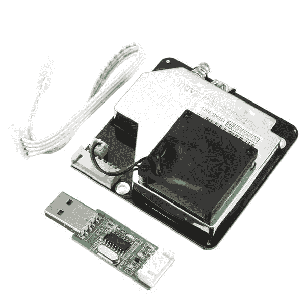

# 致力于我的物联网空气质量监测设置

> 原文：<https://dev.to/minkovsky/working-on-my-iot-air-quality-monitoring-setup-40a5>

空气质量——近年来，关于空气质量已经说了很多。研究表明，呼吸污染的空气会增加哮喘发作、过敏和其他健康问题的风险。最常见的污染物之一是颗粒物质——柴油发动机和一些汽油发动机排放的极细的碳尘。如果你住在交通繁忙的道路附近，你很可能现在就吸入一些空气，这可能会让你的肺部慢慢变黑。

顺便说一句，这是我窗外的景色:

我想知道一整天我窗外的空气中有多少灰尘，更确切地说是颗粒物质。最终目标是利用这些信息在污染水平超过政府目标时发出警报，并利用这些信息让我的地方当局负起责任。

那么，我该如何开始呢？

# SDS-011 传感器

操作的核心是 nova SDS-011 传感器。它的工作原理是将空气吹过激光束并寻找散射的反射。然后，它可以分离出由特定类型的颗粒物(PM2.5 和 PM10)引起的散射，并测量空气中有多少颗粒物，给出每立方米的微克数。

这些传感器非常便宜——在全球速卖通不到 20 英镑，如果从中国发货的话，在曼谷和易贝的价格也差不多。有些还附带了一个 USB 适配器，用于传感器的串行(UART)接口。整洁！不整洁的是长达 3 周的运输时间，但这只是从中国订购时的课程。

默认情况下，传感器会每秒连续输出测量值。如果您想测试它是否与 USB 适配器一起工作，这可能很有用。事实上，我编写了一些 Python 程序，依靠这种模式来显示传感器的读数。最简单的一个完整地在这里: