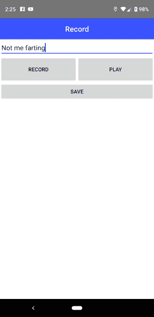
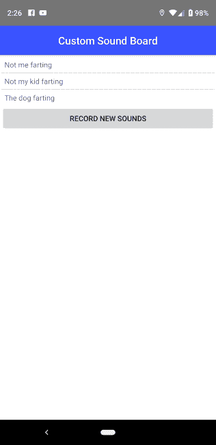
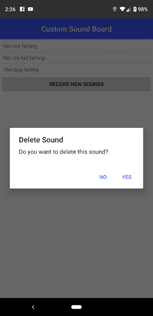

# 在 NativeScript 中使用音频-第二部分

> 原文：<https://dev.to/raymondcamden/working-with-audio-in-nativescript-part-two-4426>

几天前，我在博客上讲述了我使用音频和 NativeScript 的经历。周末，我有机会总结了我正在开发的演示应用程序，并想分享一下我的成果。像往常一样，我的工作最终是我认为进展顺利的东西和我认为…可以做得更好的东西的混合体。我会尽最大努力找出我认为可以改进的代码，并欢迎任何建议或评论。

提醒一下，这项研究的最终目标是创建一个定制的声卡应用程序。作为用户，您可以录制一段声音，以便以后播放。声卡在应用商店里一毛钱一打，但我一直认为有一个我可以自己安装的声卡会很有趣。通常我会这样想，当我的一个孩子说了一些有趣的事情，然后他们再也不会说了。因为当然。

下面是这个应用程序最终的样子。用户界面/UX 相当简单，我没有用漂亮的颜色或任何东西。最初，应用程序会让您知道您没有准备好任何声音:

[](https://res.cloudinary.com/practicaldev/image/fetch/s--qcuj8ZZC--/c_limit%2Cf_auto%2Cfl_progressive%2Cq_auto%2Cw_880/https://static.raymondcamden.cimg/2019/04/sb1.png)

点击“录制新声音”(真的应该是单数)按钮，进入下一个视图:

[](https://res.cloudinary.com/practicaldev/image/fetch/s--xFtn5D2P--/c_limit%2Cf_auto%2Cfl_progressive%2Cq_auto%2Cw_880/https://static.raymondcamden.cimg/2019/04/sb2.png)

在此视图中，您可以命名和录制声音。“播放”按钮允许您进行测试，以确保正确无误。

一旦你录制了一些声音，它们就会出现在主页上的一个简单列表中:

[](https://res.cloudinary.com/practicaldev/image/fetch/s--XMtTnNCY--/c_limit%2Cf_auto%2Cfl_progressive%2Cq_auto%2Cw_880/https://static.raymondcamden.cimg/2019/04/sb3.png)

最后，要删除一个声音(UI 应该为此提供提示)，您可以“长按”一个声音:

[](https://res.cloudinary.com/practicaldev/image/fetch/s--e_DZAvfh--/c_limit%2Cf_auto%2Cfl_progressive%2Cq_auto%2Cw_880/https://static.raymondcamden.cimg/2019/04/sb4.png)

仅此而已。所以这款应用可以归结为两个核心方面:

首先是将音频录制到文件系统中，并在以后播放。这真的很简单，在我的上一篇文章中已经介绍过了，所以我不会在这里深入探讨。

下一个方面是记住你的声音。这个有点棘手。我想让你给每个声音命名，并对用户隐藏实际的文件名。NativeScript 支持一些不错的客户端存储方法(你可以在上面阅读我的[文章](https://www.nativescript.org/blog/client-side-storage-in-nativescript-applications)！)所以唯一的问题是我会用哪一个。在这种情况下，我做了一个我认为可能不是最好的决定。我选择了应用程序设置。总的来说，我在简单的键/值系统和“适当的”存储系统之间进行选择的“规则”是——我的数据会随着用户对应用程序的使用而增长吗？我的意思是——一组“已知”值，如“首选主题”或“上次查看的产品”，是一组特定的数据，不会随着时间的推移而增长。像笔记这样的数据，用户一天可以写一百万左右，没有限制。

在我的例子中，用户有可能发出一百万个声音(好吧，不是一百万个)，但是我合理地估计他们不会发出超过三十个声音。我只存储了一个名称和一个文件路径，所以我认为这样大小的 JSON 数组应该没问题。

我保留以后为这个决定说自己愚蠢的权利。好了，我们来看代码！你可以在 https://github.com/cfjedimaster/ns-soundboard 找到完整的资料库。

我将从主视图开始，稍微修剪一下，去掉不必要的东西:

```
<template>
    <Page class="page">
        <ActionBar class="action-bar">
            <Label class="action-bar-title" text="Custom Sound Board"></Label>
        </ActionBar>

        <StackLayout>

            <Label v-if="sounds.length === 0" text="You haven't recorded any sounds yet." />

            <ListView for="sound in sounds" @itemTap="playSound">
                <v-template>
                    <Label :text="sound.name" :filename="sound.fileName" @longPress="deleteSound" />
                </v-template>
            </ListView>
            <Button text="Record New Sounds" @tap="goToRecord" />
        </StackLayout>
    </Page>
</template>

<script>
const audio = require('nativescript-audio');
const fileSystemModule = require('tns-core-modules/file-system');

import soundsAPI from '../api/sounds';
import Record from './Record';

export default {
    data() {
        return {
            audioFolder:null,
            sounds:[]
        }
    },
    created() {
        this.sounds = soundsAPI.getSounds();
        this.audioFolder = fileSystemModule.knownFolders.currentApp().getFolder('recordings');
    },
    methods:{
        async deleteSound(event) {
            let filename = event.object.filename;
            let confirmOptions = {
                title: "Delete Sound",
                message: "Do you want to delete this sound?",
                okButtonText: "Yes",
                cancelButtonText: "No"
            };
            confirm(confirmOptions).then(async result => {
                if(result) {
                    // first delete the file
                    let file = this.audioFolder.getFile(filename);
                    await file.remove();
                    soundsAPI.removeSound(filename);
                    this.sounds = soundsAPI.getSounds();
                }
            });
        },
        goToRecord() {
            this.$navigateTo(Record);
        },
        async playSound(event) {
            let player = new audio.TNSPlayer();

            await player.playFromFile({
                audioFile:this.audioFolder.path+'/'+event.item.fileName
            });

        }
    }
};
</script> 
```

Enter fullscreen mode Exit fullscreen mode

UI 非常小，所以没有太多要讨论的。然而，我确实对`longPress`事件有一些疑问。在指令上，T5 没有 T6 做得好。我不得不去找唱片公司。另一个问题是`longPress`也会触发`itemTap`，我认为这是一个错误，但老实说，我现在觉得还好。这是我想我以后可能要解决的问题。就代码而言，只有几种方法，通常唯一真正复杂的方法是删除处理程序。你可以看到我设置了一个确认对话框。然后我手动删除该文件，并要求我的`soundsAPI`库(稍后会详细介绍)删除该文件。那两句台词我觉得不对。主要问题是 soundsAPI 只处理记忆数据，而不处理任何文件 IO。

正如我所说的——这感觉是错误的，可以进行重构，但对于一个初始版本来说，我没问题。；)我们换个话题，看看那个音库。你会注意到我给它起了个名字`soundsAPI`，这听起来是个糟糕的名字，但是名字很难起。

```
const appSettings = require("application-settings");

const sounds = {
    getSounds() {
        let json = appSettings.getString('sounds', '');
        if(json === '') return [];
        else return JSON.parse(json);
    },
    removeSound(fileName) {
        let sounds = this.getSounds();
        sounds = sounds.filter(s => {
            return s.fileName != fileName;
        });
        //serialize it
        let json = JSON.stringify(sounds);  
        appSettings.setString('sounds', json);
    },
    saveSound(name, fileName) {
        let sounds = this.getSounds();
        sounds.push({
            name:name,
            fileName:fileName
        });
        //serialize it
        let json = JSON.stringify(sounds);  
        appSettings.setString('sounds', json);
    }
}

module.exports = sounds; 
```

Enter fullscreen mode Exit fullscreen mode

最终，这个“API”只是 ApplicationSettings 中一个值的包装器。不过好的一面是，我可以稍后重新访问存储，并保持 API 不变。现在我们来看第二个视图。

```
<template>
    <Page class="page">
        <ActionBar class="action-bar">
            <Label class="action-bar-title" text="Record"></Label>
        </ActionBar>

        <StackLayout>
            <TextField v-model="name" hint="Name for new sound" />
            <GridLayout columns="*,*" height="70">
                <Button text="Record" col="0" @tap="record" v-if="!recording" /> 
                <Button text="Stop Recording" col="0" @tap="endRecord" v-if="recording" /> 
                <!-- Note, I was not able to use null and falsy values -->
                <Button text="Play" col="1" @tap="play" :isEnabled="playEnabled" /> 
            </GridLayout>
            <Button text="Save" @tap="save" :isEnabled="saveEnabled" />
        </StackLayout>
    </Page>

</template>

<script>
const audio = require('nativescript-audio');
const platform = require('tns-core-modules/platform');
const fileSystemModule = require('tns-core-modules/file-system');

import utils from '../api/utils';
import sounds from '../api/sounds';

import Home from './Home';

function randomName() {
    return `rnd${utils.generateUUIDv4()}.mp4`;
}

export default {
    created() {
        this.audioFolder = fileSystemModule.knownFolders.currentApp().getFolder('recordings');
    },
    computed:{
        playEnabled() {
            return this.lastName != '' && !this.recording;
        },
        saveEnabled() {
            return this.playEnabled && this.name !== '';
        }
    },
    data() {
        return {
            name:"",
            audioFolder:null,
            recorder:null,
            recording:false,
            lastName:''
        }
    },
    methods: {
        async record() {

            // possible clean up
            if(this.lastName) {
                let file = this.audioFolder.getFile(this.lastName);
                await file.remove();
            }

            console.log('doRecord Called 1h');
            this.recorder = new audio.TNSRecorder();

            let newName = randomName();

            /*
            from the sample app
            */
            let androidFormat;
            let androidEncoder;
            if (platform.isAndroid) {
                // static constants are not available, using raw values here
                // androidFormat = android.media.MediaRecorder.OutputFormat.MPEG_4;
                androidFormat = 2;
                // androidEncoder = android.media.MediaRecorder.AudioEncoder.AAC;
                androidEncoder = 3;
            }

            let options = {
                filename:this.audioFolder.path+'/'+newName,
                format:androidFormat,
                encoder:androidEncoder,
                infoCallback:info => {
                    //apparently I'm necessary even if blank
                },
                errorCallback:e => {
                    console.log('error cb',e);
                }
            };

            await this.recorder.start(options);
            this.recording = true;

            //remember the filename for delete and playback purposes
            this.lastName = newName;

        },
        async endRecord() {
            await this.recorder.stop();
            this.recording = false;
            console.log('finished recording');
        },
        async play() {
            console.log('doPlay called');
            let player = new audio.TNSPlayer();

            await player.playFromFile({
                audioFile:this.audioFolder.path+'/'+this.lastName
            });

        },
        save() {
            sounds.saveSound(this.name, this.lastName);
            this.$navigateTo(Home);
        }

    }
}
</script> 
```

Enter fullscreen mode Exit fullscreen mode

好吧，这个更激烈一点。此视图允许您录制音频，并且必须使用一些逻辑来处理一些情况:

*   首先，我们给这个文件取什么名字？为此，我使用一个库来生成一个 UUID ( `generateUUIDv4`)。
*   如果你录下一段声音，然后再录一遍，我们会删除第一段。因此，我们必须记住，我们事先发出了声音，并清理它。注意，如果你使用后退按钮，我不支持“清理”。哎呀。
*   你只允许保存录音，如果你命名并做一个记录。所以按钮逻辑变得有点复杂。你可以在`computed`部分看到。除此之外，大部分代码都与这个主题的第一个博客条目有关。

就是这样！你怎么想呢?请给我留下任何建议，或者随时向[存储库](https://github.com/cfjedimaster/ns-soundboard)提交一个拉取请求。