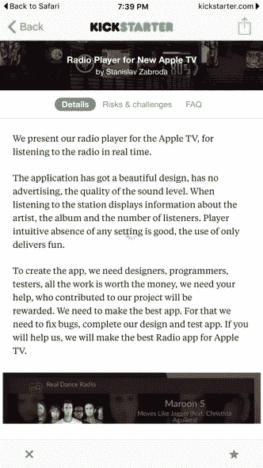

# 在个人项目上与其他人合作

> 原文：<https://dev.to/gabek/working-with-others-on-personal-projects-4e9d>

我喜欢和其他人一起工作。我喜欢让人们抛弃想法，并对我处理事情的方法进行理智检查。我喜欢在对话中听到另一种声音时产生的额外创造力，我喜欢向比我更了解某个话题的人学习。

对于个人项目来说，这通常是相当困难的。不管出于什么原因，我的许多项目都是从我使用一种我从未使用过的技术开始的。所以我想写一点我的经历，以及我试图加入其他声音的尝试，这些声音的核心只是我的事情。

当我第一次为 Roku 构建 Bat 播放器时，[在](https://gabekangas.com/blog/2014/12/developing-for-roku/)之前，我从未接触过 Roku 开发。事实上，我从来没有见过一个人。所以我在 Github 上完全公开地写了它，希望其他关注 Roku 项目的人会感兴趣。我应该更清楚，因为一开始就没有多少 Roku 开发者，所以出现合作者的可能性很低。

我对 AppleTV 的 Bat 播放器[也做了同样的事情，因为我知道当有人在 Github 上查看一个 AppleTV 应用程序时，他表现出兴趣的几率会高得多。当**有人复制了它，更改了名字，并且**](https://gabekangas.com/project/thebatplayer/)**[以他自己的名字把它放在应用商店](http://www.148apps.com/app/1051556217/)的时候，这个应用甚至还没有完成。然后**他开始了众筹活动**，这样他就可以雇人继续工作。在说服他从 AppleTV 应用商店中删除它并停止他的资助活动后，我立即从 Github 上撤下了它，再也没有放回去。**

因此，我们有一个例子，有人可以找到我说:“嘿，我喜欢你的应用程序，我可以成为它的一部分吗？”相反，他偷了它，并试图从我的作品中赚钱。如果他不是那么可怕的话，也许我们可以成为一个伟大的团队。

当我开始做长尾音乐的时候，我知道有很多机会让其他人参与进来。单纯从产品方面来说，我以前从未在 React 中开发过 web 应用程序，一般来说，我以前也从未开发过如此大规模的 web 应用程序，因为我不是一个日常的 web 开发人员。除此之外，Longtail 的许多工作都集中在与站长的非技术性沟通、与电视台的联系以及所有这些关系的管理上。所以我花时间在联合创始人论坛上，和人们交谈，追踪线索，但是没有运气。寻找共同创始人很难。如果你是一个技术人员，你需要找一个商务人员来购买你的产品，而商务人员已经认为他们的想法更好，因为他们是“创意人员”。如果你是一个商业人士，想找一个技术人员，你必须说服某人免费开发一些东西来实现你的想法。我属于前者，在 Longtail 中找人帮忙做非技术性的工作并不成功。

至于构建 Longtail，显然仅仅将代码放在 Github 上并不是一种积极寻找合作者、分享知识和构建东西的方式。你必须比那更积极主动。没有什么比雇佣某人和你一起工作更主动的了。所以我就是这么做的。

在开发过程中，有几次我真的希望在处理技术问题时有第二双眼睛，我愿意为此付出代价。所以我雇了一个自由承包商和我一起做一些事情。花了一些时间熟悉这个项目，然后他说他们帮不了忙，就退出了。所以我又试了几次，模式又重复了一遍。一旦到了真正做某事的时候，这个人就会推掉，说他们无法前进。这是我的一个例子，学习新的东西，建立新的东西，想要获得一些技巧，最佳实践，并与其他人合作… **我支付他们**，仍然没有运气。

虽然我可以把这理解为“我做的工作太糟糕了”，或者“我太糟糕了，以至于人们拒绝和我一起工作”，但我认为事实是这些在线自由职业者不擅长在现有的代码库中工作，觉得自己不知所措，或者更喜欢被非技术人员雇佣来共同完成新项目，而不是和技术人员一起工作在现有的项目上，在那里他们可以被评判。坦率地说，**你不能花钱请人来关心你或在你身上付出努力。至少不是我的预算。**

所以现实一点，我知道不是我，但这不代表我对整件事没有一点复杂。我试图让人们和我一起做项目的记录是 0%。如果我付钱给他们。

如果我的要求有些疯狂，我会理解，但通常情况是:

1.  我在尝试新的东西。
2.  我找到一个自称有深厚 it 背景的自由职业者。
3.  我希望他们与我分享他们的知识和最佳实践。
4.  **但是他们不能**。

通常的评论是这样的:*“这个项目比我想象的要复杂得多”*，或者*“我不再有我期望的时间来做这个项目”*。

我的同事似乎喜欢和我一起工作，我有运输货物的记录，所以看起来人们可能想做一些有共同兴趣的事情。

那么为什么我现在要写这个呢？目前我正在编写我的第一个 macOS 应用程序。虽然我在 iOS 中的许多工作经验可以转移到桌面上，但 Mac 上 AppKit 的传奇历史中有许多非常特殊的怪癖，鉴于 AppKit 是在 1989 年发布的，我想挖掘人们所有的经验，并从专门从事 it 的人那里获得一些提示和最佳实践。你可能会猜到结果有多好。

不过，我会以更积极的方式结束。我很幸运地雇佣了几个我个人认识的设计师，为我目前的项目和已经成功的长尾音乐工作。我认为雇佣一名设计师对我来说更成功，不仅仅是因为我以前认识他们，还因为我不是设计师。我认为和某人一起工作*和为某人工作*在*会有很不一样的感觉。对于设计，我说“这是我的想法，疯狂吧”，一段时间过去了，然后我得到了一些结果。我希望与开发人员携手合作，学习一些东西，并一起创造产出。除非你超级自信，超级有能力，否则这种工作方式可能会让人不舒服。*

