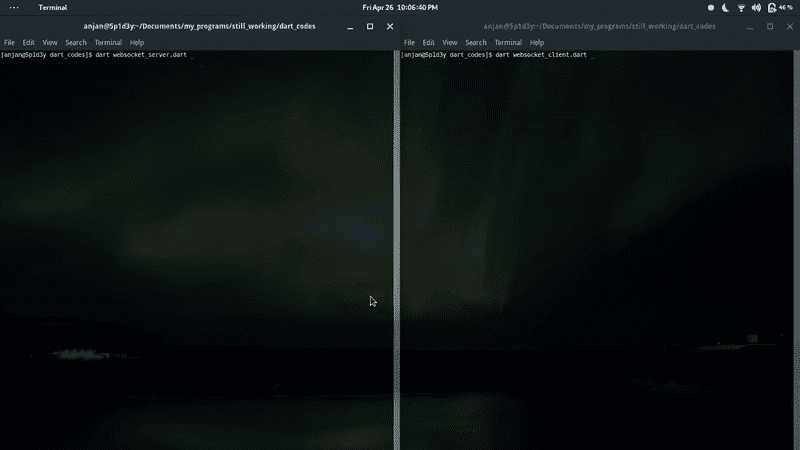

# 使用 WebSocket

> 原文：<https://dev.to/itzmeanjan/working-with-websocket-10gh>

## 初始化

*WebSocket* -用于实时数据传输场景，如多人游戏/聊天机器人/物联网中的传感器网络等。

### 定义

嗯， *WebSocket* 只是一个普通的 *HTTP* 连接，做了一些修改，其中一个普通的 *HTTP* 连接升级为 *WebSocket* 连接，当两个正在通信的*对等方*同意使用一个套接字进行所有通信，然后握手。它可以被认为是两个*对等体*之间的双向通信通道。当通信结束时，该套接字被销毁。

## 想法

也许你已经使用 *NodeJS* 或 *Java* 或 *PHP* 或 *Python* 或其他东西使用过 *WebSocket* ，但是今天我们将使用 *Dart 语言*以一种更简单的方式实现两个 *WebSocket 服务器&客户端*。

好了，让我们开始编码吧...

## 弈

首先我们要写一个 *WebSocket 服务器*

### WebSocket 服务器

正如我已经说过的， *WebSocket* 是一个 *HTTP* 连接的修改版本，我们将创建一个 *HttpServer* ，然后我们将该连接升级到 *WebSocket* 。

```
import 'dart:io' show HttpServer, HttpRequest;
main() {
  HttpServer.bind('localhost', 8000).then((HttpServer server) {
      // httpserver listens on http://localhost:8000
    print('[+]HttpServer listening at -- http://localhost:8000');
    server.listen((HttpRequest request) {

       // more code goes here

    }, onError: (err) => print('[!]Error -- ${err.toString()}'));
  }, onError: (err) => print('[!]Error -- ${err.toString()}'));
} 
```

现在我们有了 *HttpRequest* 对象，它将被升级为 *WebSocket* 。

```
import 'dart:io' show WebSocket, WebSocketTransformer;
import 'dart:convert' show json;
import 'dart:async' show Timer;
// will put this snippet with in main()
WebSocketTransformer.upgrade(request).then((WebSocket ws) {
    // upgradation happens here and now we've a WebSocket object
        ws.listen( // listening for data
          (data) {
            print(
                '\t\t${request?.connectionInfo?.remoteAddress} -- ${Map<String, String>.from(json.decode(data))}'); // client will send JSON data
            Timer(Duration(seconds: 1), () {
              if (ws.readyState == WebSocket.open)
                ws.add(json.encode({
                  'data': 'from server at ${DateTime.now().toString()}', // in response JSON data is sent back to client
                })); // Timer helps to schedule code execution
            });
          },
          onDone: () => print('[+]Done :)'),
          onError: (err) => print('[!]Error -- ${err.toString()}'),
          cancelOnError: true,
        );
      }, onError: (err) => print('[!]Error -- ${err.toString()}')); 
```

看到了吗，用❤️.的 *Dart* 将一个 *HTTP* 连接升级到 *WebSocket* 连接就这么简单

这是我们完整的 *WebSocket 服务器*代码。

```
import 'dart:io' show HttpServer, HttpRequest, WebSocket, WebSocketTransformer;
import 'dart:convert' show json;
import 'dart:async' show Timer;

main() {
  HttpServer.bind('localhost', 8000).then((HttpServer server) {
    print('[+]WebSocket listening at -- ws://localhost:8000/');
    server.listen((HttpRequest request) {
      WebSocketTransformer.upgrade(request).then((WebSocket ws) {
        ws.listen(
          (data) {
            print(
                '\t\t${request?.connectionInfo?.remoteAddress} -- ${Map<String, String>.from(json.decode(data))}');
            Timer(Duration(seconds: 1), () {
              if (ws.readyState == WebSocket.open)
              // checking connection state helps to avoid unprecedented errors
                ws.add(json.encode({
                  'data': 'from server at ${DateTime.now().toString()}',
                }));
            });
          },
          onDone: () => print('[+]Done :)'),
          onError: (err) => print('[!]Error -- ${err.toString()}'),
          cancelOnError: true,
        );
      }, onError: (err) => print('[!]Error -- ${err.toString()}'));
    }, onError: (err) => print('[!]Error -- ${err.toString()}'));
  }, onError: (err) => print('[!]Error -- ${err.toString()}'));
} 
```

让我们来看看 *WebSocket 客户端*。

### WebSocket 客户端

现在 *Dart* 在 *dart:io* 中有了一个类 *WebSocket* ，它负责实现 *WebSocket 客户端*，为我们⚒️.做所有的重要工作

你可以假设， *WebSocket 客户端*的实现会容易得多。

```
import 'dart:io' show WebSocket;
import 'dart:convert' show json;
import 'dart:async' show Timer;

main() {
  WebSocket.connect('ws://localhost:8000').then((WebSocket ws) {
      // our websocket server runs on ws://localhost:8000
    if (ws?.readyState == WebSocket.open) {
        // as soon as websocket is connected and ready for use, we can start talking to other end
      ws.add(json.encode({
        'data': 'from client at ${DateTime.now().toString()}',
      })); // this is the JSON data format to be transmitted
      ws.listen( // gives a StreamSubscription
        (data) {
          print('\t\t -- ${Map<String, String>.from(json.decode(data))}'); // listen for incoming data and show when it arrives
          Timer(Duration(seconds: 1), () {
            if (ws.readyState == WebSocket.open) // checking whether connection is open or not, is required before writing anything on socket
              ws.add(json.encode({
                'data': 'from client at ${DateTime.now().toString()}',
              }));
          });
        },
        onDone: () => print('[+]Done :)'),
        onError: (err) => print('[!]Error -- ${err.toString()}'),
        cancelOnError: true,
      );
    } else
      print('[!]Connection Denied');
      // in case, if serer is not running now
  }, onError: (err) => print('[!]Error -- ${err.toString()}'));
} 
```

难道不比 *WebSocket 服务器*实现简单吗？

是的，用 **930 字节**的客户端 Dart 代码和 **1175 字节**的服务器端 Dart 代码，我们已经完成了 *WebSocket* 的实现。

## 运行

确保您已经在这里安装了[的 *Dart SDK* 并正确设置了 *PATH* 变量。](https://www.dartlang.org/tools/sdk)

是时候赶走这些野兽了😆

```
$ dart websocket_server.dart 
```

而在另一个终端

```
$ dart websocket_client.dart 
```

和💥

[](https://res.cloudinary.com/practicaldev/image/fetch/s--YMQJqm6n--/c_limit%2Cf_auto%2Cfl_progressive%2Cq_66%2Cw_880/https://thepracticaldev.s3.amazonaws.com/i/isuke2pbyjupnwenft1l.gif)

## 结束

在本文中，您已经学习了如何使用 *Dart* 构建 *WebSocket* 对等体，传输实时数据。

> 有什么问题吗？
> 
> 是
> 
> 在 [Twitter](https://twitter.com/meanjanry) 上找到我

总结时间。下一篇文章再见。

与此同时，你可以查看我的 *GitHub* [简介](https://github.com/itzmeanjan/)了解我的其他项目。