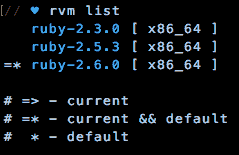
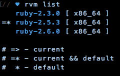
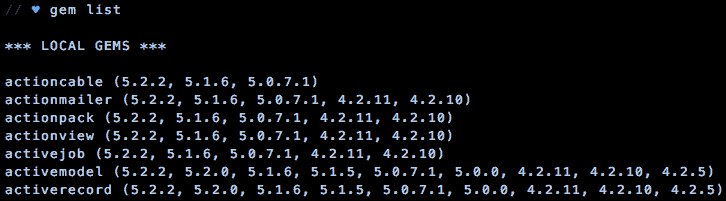
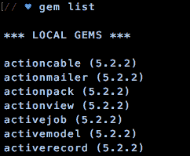

# 争论 RVM 和红宝石

> 原文：<https://dev.to/billywitherspoon/wrangling-rvm-and-ruby-gems-1534>

<figure>[](https://res.cloudinary.com/practicaldev/image/fetch/s--t7fbnpeF--/c_limit%2Cf_auto%2Cfl_progressive%2Cq_auto%2Cw_880/https://cdn-images-1.medium.com/max/1024/0%2AVkIYx3y_Bafqh-QY) 

<figcaption>照片由[甄嬛](https://unsplash.com/@zhenhu2424?utm_source=medium&utm_medium=referral)于[上](https://unsplash.com?utm_source=medium&utm_medium=referral)</figcaption>

</figure>

*注意:所有引用的命令都使用 Mac OS X 终端上的 Bash shell。*

### RVM (Ruby 版本经理)

#### 什么是 RVM？

RVM 是一个旨在帮助你管理 Ruby 本地版本的平台。它将 Ruby 的版本和为该版本安装的每个相关的 gem 分开。

安装 RVM 后，让我们直接进入它的一些用途。

#### RVM 命令

嗯，如果一开始就没有 ruby，我们就无法管理它。我将继续安装一些版本的 Ruby。

***安装最新版本的 Ruby***

```
rvm install ruby
```

***安装特定版本的 Ruby(用版本号替换 X . X . X)***

```
rvm install ruby-X.X.X
```

为了演示，我安装了最新版本的 Ruby (ruby-2.6.0)以及另外两个版本(ruby-2.3.0 和 ruby-2.5.3)。

***返回当前已安装版本列表***

```
rvm list
```

这是我在我的机器上运行它时的样子。



我目前运行的是最新版本。走吧我。但是，如果我刚刚被分配到一个需要我运行 2.6.0 之前的任何版本的项目，该怎么办呢？我有几个命令可以支配。

***更改 Ruby 当前版本(用版本号替换 X . X . X)***

```
rvm use X.X.X
```

这将暂时改变我的 shell 中的 Ruby 版本。当打开一个新的终端外壳时，Ruby 将重置为我的默认值。如果我需要在短时间内快速完成一个项目，而不改变我的默认 Ruby 版本，这是最好的选择。

***更改 Ruby 的默认版本(用版本号替换 X . X . X)*T3】**

```
rvm --default use X.X.X
```

当我打开一个新的终端外壳时，这将是 Ruby 的默认版本。让我们假设这是一个长期项目，我会用这个。

***删除 Ruby 的一个版本(用版本号替换 X . X . X)*T3】**

```
rvm remove X.X.X
```



#### 红宝石镶嵌

每个 Ruby 版本都有相关的宝石。请记住，当您安装、更改或删除一个版本的 Ruby 时，无论已经安装了什么 gems 与该版本相关联，它都会随之而去。由于有了一个名为 Bundler 的 Ruby Gem，在本地跟踪单个 Gem 就不那么重要了。

### 红宝石

<figure>

<figcaption>Photo by [Mahkeo](https://unsplash.com/@mahkeo?utm_source=medium&utm_medium=referral) on [Unsplash](https://unsplash.com?utm_source=medium&utm_medium=referral)</figcaption>

</figure>

#### 什么是红宝石？

gem 是一个软件包，可以用来增强 ruby 程序的功能。我们已经知道了一个宝石(bundler)。我不会深入探讨所有类型的 ruby gems，但是它们是使任何 ruby 项目更有能力的一个很好的补充。

#### 基本的 Ruby Gem 命令

***安装一颗红宝石***

```
gem install gem_name
```

***列出已安装的宝石***

```
gem list
```

很简单的东西。现在，让我们看看本地安装的 gems 列表。



截断到只有前 7 个宝石，我们可以看到…这是很多！让我们做一些卸载。

注意:如果你试图移除一个属于依赖关系的 gem，这些命令都会提示你，多么有用！

***清除所有宝石的所有旧版本***

```
gem cleanup
```

***清除特定宝石的所有旧版本***

```
gem cleanup gem_name
```

***卸载所有版本的宝石***

```
gem uninstall gem_name
```

***卸载某个版本的 gem(用版本号替换 X . X . X)***

```
gem uninstall gem_name -v, X.X.X
```

***删除低于指定版本的所有版本(用版本号替换 X . X . X)***

```
gem uninstall gem_name -v, '<X.X.X'
```



好多了！我们的宝石像肥皂一样干净。

应该注意的是，由于兼容性，旧版本的 gems 肯定是有用的。然而，如果使用 Bundler，这不会是一个问题，因为它会简单地重新安装任何必要的缺失的宝石。关于这一点，我们再多了解一点。

### 大错

<figure>

<figcaption>Photo by [Radek Grzybowski](https://unsplash.com/@rgrzybowski?utm_source=medium&utm_medium=referral) on [Unsplash](https://unsplash.com?utm_source=medium&utm_medium=referral)</figcaption>

</figure>

#### 什么是 Bundler？

Bundler 是 2009 年发布的(抱歉编码 vets)作为 Ruby 项目的 Ruby gem 管理系统。它有多种好处:

*   它允许用户指定 Ruby gems(在一个 gem 文件中),在处理一个项目之前必须安装在本地
*   它允许用户指定 Ruby gems 的特定版本
*   它自动安装指定的 Ruby gems 和任何 gem 依赖项
*   它创建一个 gem 文件锁来记录安装的 gem

#### 邦德勒魔术

***检查并安装项目所需缺失的宝石***

```
bundle install
```

一个命令就能统治所有人！

<figure>

<figcaption>Photo by [Andres Iga](https://unsplash.com/@andresiga?utm_source=medium&utm_medium=referral) on [Unsplash](https://unsplash.com?utm_source=medium&utm_medium=referral)</figcaption>

</figure>

那么 bundler 在幕后用这个命令做什么呢？

1.  读取 gemfile 锁(如果存在)
2.  读取 gem 文件
3.  向 RubyGems.org 查询每个指定 gem 的每个版本的列表
4.  查找 gem 文件允许的 gem 版本，包括任何必要的依赖 gem
5.  在 gemfile 锁中写下这些版本
6.  将所有宝石安装在宝石文件锁中

强大的东西！在任何 Ruby 项目中，Bundler 都是保持 gems 整洁有序的必要工具。

**祝贺你！考虑你的红宝石争吵！**

