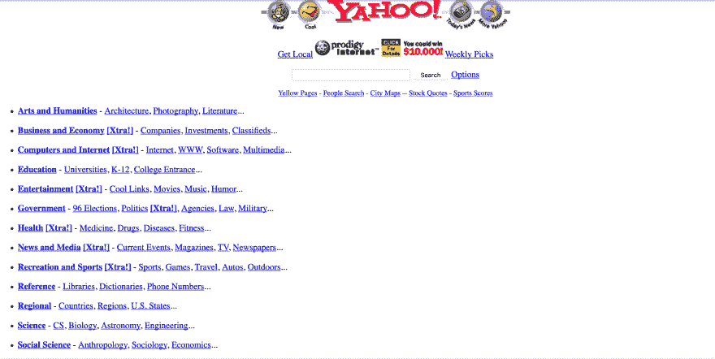

# 写垃圾代码

> 原文：<https://dev.to/polluterofminds/write-shitty-code-4olf>

早在 1996 年，当我上七年级时，我上了第一堂计算机课。我不太记得我们在课堂上学到了什么，只记得我第一次接触到了 HTML。我第一次尝到了“观源”。我第一次尝到了如何让网页看起来像他们想要的任何东西。对我来说，这意味着字面上复制雅虎！主页和改变背景颜色，同时也改变了贾斯汀的标志！

如果你不记得雅虎！看起来就像 1996 年的样子(也是当时大多数网络的样子)，这里有一个快照:

我没有用我的雅虎复制粘贴“叉子”做任何开创性的事情！的来源，但我确实抓住了错误。从那以后我就喜欢上了电脑和科技。在大学里，在最终失败之前，我从一个专业跳到另一个专业，期间我参加了一个网页设计课程。我当时没有意识到的是，使用 Dreamweaver(我们在课堂上使用的软件)设计网站并不完全是编码。我也没有意识到像 Dreamweaver 这样的产品有多超前。“所见即所得的编辑器并没有像编辑雅虎那样逗我开心！”的源代码在几年前就有了，而且课程并没有关注 Dreamweaver 的代码编辑器部分。于是，我的编码之旅就在那堂课上告一段落了。

至少有一段时间。

在这 15 年多的时间里，我多次尝试学习编码。当然是先学了 HTML 和 CSS。我很喜欢这样，但是我想让网页做些事情。所以，我尝试了一下 JavaScript。起初，我试图通过书本学习，因为我知道如果没有基础知识，我注定会失败。但是从书本中学习如何在网络上工作...奇怪。所以，我转到了 YouTube 视频。我走得更远，但我陷入了这种困境，基础理论非常枯燥，没有某种形式的实际应用。当然，一个变量很酷，但是我怎么用它来让我的网站做 X 呢？一个 for 循环看起来很棒，但是我什么时候才能让它做除了计数以外的事情呢？

我相信我不是一个人有这种感觉。我怀疑许多走非传统道路的新开发人员最终会像我一样对传统的学习方式感到沮丧和厌倦。我甚至尝试了在线编码学校，比如树屋和 T2 代码学院。这两个都是很棒的程序，自从我尝试后已经发展了很多，但那时，我仍然很无聊，无法克服学习基础知识的困难。

再过几年，我已经从事非开发工作十多年了。我还发现，除了喜欢网络，我还喜欢写作。我在学习发展的基础方面有困难，但我在写作(确切地说是创造性写作)的基础方面没有这样的问题。2004 年，我参加了一个创造性写作的艺术硕士项目，写了无数的故事，甚至几部小说.所有这些文字都储存在谷歌文档中。与我的同学们遵循的陈旧模式相比，我喜欢这项技术的便利性。保存到 Word。邮件抄送给自己。获取电子邮件和下载文件。在另一台机器上处理 Word。我再也不会回到那个模式了。所以谷歌文档为我工作。

直到它没有。

从那时起，我已经对谷歌这样的大型科技公司产生了怀疑。但直到我即将完成我的艺术硕士项目时，我才意识到我实际上已经交出了我最重要的作品的控制权。我想相信我控制了那些文件。谷歌告诉我我是，对吗？但事实是，谷歌可以随时锁定我。他们可以告诉我，我违反了他们的服务条款，他们没有义务告诉我具体是如何违反的，他们也没有义务向我提供任何形式的听证或仲裁程序。如果那样的话，我会失去一切。

不久前，我意识到一些记者(和其他人)被谷歌账户意外锁定，无法访问他们的作品。这不是我的想象。谷歌对我的写作控制太多了。

我决定找一个谷歌文档的替代品，让我这次可以真正拥有我的写作。我需要知道无论我能接触到什么？然而，没有这样的产品存在。至少我找不到。所以，我有两个选择。我可以重新使用微软的 Word，把我写的东西储存在我的电脑上，其他任何我使用的设备都无法访问。或者，我可以为自己开发一个写作应用。

我想你可能已经猜到了，我选择了第二个选项。

尽管除了 HTML 和 CSS，我几乎没有任何经验，我还是一头扎了进去。我知道我会用 JavaScript 编写应用程序，所以我开始寻找简单的 JavaScript web 应用程序教程。我通过阅读博客帖子和编码网站构建了一些小应用程序。我仍然不明白我在做的每件事，但我对此没意见。我可能不明白我在做什么，但我看到了切实的成果。下一步是投入到一些能让我开发出我想要的应用程序的东西中。

学习编码有很多选择。我之前谈了几个，但是到了构建一个功能应用程序的时候，我选择了 [Udemy](http://udemy.com/) 。Udemy 有一个令人难以置信的课程库，可以帮助你学习基础知识，学习高级概念，以及学习介于两者之间的一切。我选了一门 React 课程(尽管我还不知道所有普通 JavaScript 的基础知识)，然后开始工作。

我开发了一个功能齐全的全栈 MERN 应用。然后我又造了一个。最后，我又看了一遍课程，对自己理解核心概念的能力更有信心了，我在这个过程中构建了自己的应用程序，而不是构建课程的应用程序。

最后，我有了第一个石墨的功能版本。

为了达到这个目标，我必须扩展我在课程中学到的东西。我必须从课程中获取概念，深入研究它们，并将它们应用到我正在构建的应用程序中。这意味着，Stackoverflow，Google，博客帖子等等。除了课程本身。这意味着编写[意大利面条代码](https://www.urbandictionary.com/define.php?term=spaghetti%20code)只是为了让应用程序基本上工作。你猜怎么着？我发布了那个意大利面条代码。

这款应用本来就不应该面向公众。本来应该是我一个人的。但是我身边的人鼓励我说出来，我也说了。我把它和虫子一起运走了。我把大部分代码都写在一个 JavaScript 文件中。我带着对单页面应用程序如何工作、React 如何工作以及 JavaScript 如何工作的很少了解来发布它。简而言之，我发布了劣质代码。

但是，这是从整篇文章中得出的一个重要观点，如果我等到完全理解了所有的事情，我根本不会发布这个应用程序，并且可能会放弃。如果我等到我写了漂亮的、可重用的代码，我就不会有一个拥有成千上万用户的应用程序。我甚至不会有一个应用程序作为我的用户。如果我等待并试图确定每一个微小的基本细节，我会放弃。

如果我退出，我永远也学不会这些基础知识。

看，在我发布我的应用程序后，我一直在学习。我在世界上有一个产品，我想让它变得更好。于是我不断的上课，不断的读书，不断的重构。我已经重写了 Graphite 至少四次，这还不包括小的重构。这是为产品公司开发应用程序的可行方式吗？不。这是一个最终克服编码障碍、发布应用程序和学习的好方法吗？是啊，的确是。

基础知识很重要，但是我相信如果你在编码之旅中遇到了障碍，你应该发布一些东西。参加一个让你从 A 点到达 b 点的课程。在你建立了它之后，要学会改进它。对许多人来说，学习基础知识而不实际应用这些基础知识是可以的。但是对于那些像我一样苦苦挣扎的人来说，不理解基本原理也没关系。在学习普通的旧 JavaScript 如何工作之前，使用 JavaScript 框架是可以的。你有权做任何你需要做的事情来度过难关。

但是克服困难意味着继续学习。写蹩脚的代码，但不断变得更好。