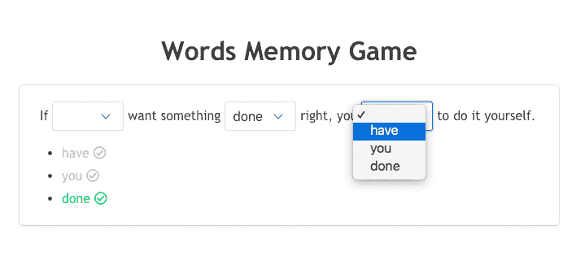
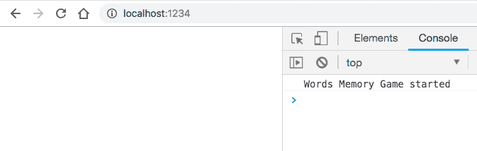
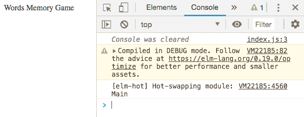
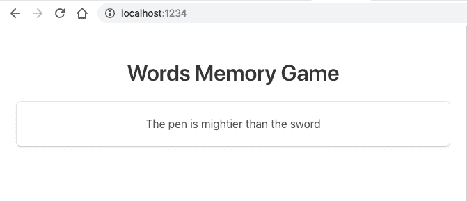

# 用 Elm 编写单词记忆游戏——第 1 部分:用 Parcel 设置 Elm 应用程序

> 原文：<https://dev.to/mickeyvip/writing-a-word-memory-game-inelm---part-1-setting-up-an-elm-application-with-parcel-1ppk>

这是“在 Elm 中编写单词记忆游戏”系列的第 1 部分，查找:

*   第 1 部分:使用 Parcel 设置 Elm 应用程序
*   [第二部分:建模和构建一个基本的单词记忆游戏](https://dev.to/mickeyvip/writing-a-word-memory-game-inelm---part-2-modeling-and-building-a-basic-word-memory-game-583g)
*   [第三部分:重新思考模型](https://dev.to/mickeyvip/writing-a-word-memory-game-in-elm-part-3-rethinking-the-model-2ajp)
*   [第四部分:用随机性增加趣味](https://dev.to/mickeyvip/writing-a-word-memory-game-in-elm-part-4-spicing-things-up-with-randomness-58ei)
*   [第 5 部分-更多的随机性和更多的游戏](https://dev.to/mickeyvip/writing-a-word-memory-game-in-elm-part-5-more-randomness-and-more-game-1i37)

* * *

# 前言

最有效的学习方法之一就是实践。我正在寻找一个项目来提高我的榆树技能，一个朋友给了我一个极好的主意——写一个单词记忆游戏。

**注:**这一系列帖子反映了我个人的学习经验，欢迎任何建设性的反馈。

# 记忆游戏

有一句话玩家可以读出来。然后取出几个单词，玩家必须根据记忆重建句子。

例如，句子是:

> 如果你想把事情做好，你必须自己去做。

去掉了几个词:

> 如果——想要什么东西——对，你——自己去做。"

[](https://res.cloudinary.com/practicaldev/image/fetch/s--D5IxhjOE--/c_limit%2Cf_auto%2Cfl_progressive%2Cq_auto%2Cw_880/https://thepracticaldev.s3.amazonaws.com/i/zijfhkxcnplbo93mv7if.png)

这个游戏非常简单，但是有很多方法可以扩展它:

*   缺失的单词可以就地(作为下拉列表)呈现给用户，或者作为列表呈现在句子附近
*   每当玩家猜出正确的单词时，他们可以立即得到通知，或者只有当所有的单词都被使用时才知道结果
*   在游戏开始时，玩家只能看到这句话几秒钟
*   等等

# 启动项目

为了使开发周期更容易，我选择使用 package bundler，它从`v1.10.0`开始支持 Elm，从`v1.11.0`开始支持`HMR`。

让我们创建一个项目文件夹，例如`word-memory-game`、`cd`并初始化 NPM 项目:

```
$ npm init -y 
```

Enter fullscreen mode Exit fullscreen mode

`-y`选项将接受所有默认值并创建`package.json`文件。

让我们在本地安装包捆机(也可以在全球安装):

```
$ npm i -D parcel-bundler 
```

Enter fullscreen mode Exit fullscreen mode

继[包裹开始](https://parceljs.org/getting_started.html)之后，我们再加上`index.html` :

```
<!doctype html>
<html>
<body>
    <script src="./index.js"></script>
</body>
</html> 
```

Enter fullscreen mode Exit fullscreen mode

和`index.js` :

```
console.log('Words Memory Game started'); 
```

Enter fullscreen mode Exit fullscreen mode

同样，让我们将下面几行添加到`package.json`的`scripts`部分:

```
"scripts":  {  "dev":  "parcel index.html",  "build":  "parcel build index.html"  } 
```

Enter fullscreen mode Exit fullscreen mode

为了启动开发服务器，让我们运行:

```
$ npm run dev 
```

Enter fullscreen mode Exit fullscreen mode

并导航到 [http://localhost:1234](http://localhost:1234)

[](https://res.cloudinary.com/practicaldev/image/fetch/s--1IIvRph1--/c_limit%2Cf_auto%2Cfl_progressive%2Cq_auto%2Cw_880/https://thepracticaldev.s3.amazonaws.com/i/7n44btxdtfwiycpk703a.png)

为了在页面中托管我们的 Elm 应用程序，让我们添加

```
<div id="app"></div> 
```

Enter fullscreen mode Exit fullscreen mode

至`index.html` :

```
<!-- index.html -->

<!doctype html>
<html>
<body>
    <div id="app"></div>
    <script src="./index.js"></script>
</body>
</html> 
```

Enter fullscreen mode Exit fullscreen mode

让我们创建`src`文件夹，并将`Main.elm`添加到其中:

```
module Main exposing (main)

import Html

main =
    Html.text "Words Memory Game" 
```

Enter fullscreen mode Exit fullscreen mode

并将`index.js`改为:

```
import { Elm } from "./src/Main.elm";

Elm.Main.init({
  node: document.getElementById("app")
}); 
```

Enter fullscreen mode Exit fullscreen mode

在我们保存所有文件后，package 将自动初始化一个 Elm 项目(包括创建`elm.json`文件)，安装所需的依赖项并重新加载。我们还可以手动重新加载页面，从控制台清除所有以前的错误。

[](https://res.cloudinary.com/practicaldev/image/fetch/s--UW4Z_Eml--/c_limit%2Cf_auto%2Cfl_progressive%2Cq_auto%2Cw_880/https://thepracticaldev.s3.amazonaws.com/i/jeyd5pq4ohbhm2z229e9.png)

现在让我们通过添加`Msg`、`Model`、`view`和`update`，以及更新`main` :
，使我们的 Elm 框架成为一个真正的 Elm 应用程序

```
module Main exposing (main)

import Browser
import Html exposing (Html)

type alias Model =
    { sentence : String
    }

initialModel : Model
initialModel =
    { sentence = "The pen is mightier than the sword" }

type Msg
    = NoOp

update : Msg -> Model -> Model
update msg model =
    case msg of
        NoOp ->
            model

view : Model -> Html msg
view model =
    Html.text model.sentence

main : Program () Model Msg
main =
    Browser.sandbox
        { init = initialModel
        , update = update
        , view = view
        } 
```

Enter fullscreen mode Exit fullscreen mode

太好了！我们有基本的“你好，世界！”。

我个人喜欢我的应用程序看起来不错，所以让我们在我们的`index.html`中添加流行的[布尔玛](https://bulma.io/) CSS 框架(或者我们可以在本地安装并导入它)和一个布尔玛推荐的`meta`标签:

```
<!DOCTYPE html>
<html lang="en">
    <head>
        <meta charset="UTF-8" />
        <meta name="viewport" content="width=device-width, initial-scale=1" />
        Words Memory Game
        <link
            rel="stylesheet"
            href="https://cdnjs.cloudflare.com/ajax/libs/bulma/0.7.2/css/bulma.min.css"
        />
    </head>
    <body>
        <div id="app" class="section"></div>
        <script src="./index.js"></script>
    </body>
</html> 
```

Enter fullscreen mode Exit fullscreen mode

现在在`Main.elm`中，让我们更新我们的`view`函数，在一个漂亮的框中显示一个标题和一个句子:

```
view : Model -> Html msg
view model =
    main_ [ class "section" ]
        [ div [ class "container" ]
            [ viewTitle
            , div [ class "box" ]
                [ p
                    [ class "has-text-centered" ]
                    [ text model.sentence ]
                ]
            ]
        ]

viewTitle : Html msg
viewTitle =
    h1 [ class "title has-text-centered" ]
        [ text "Words Memory Game" ] 
```

Enter fullscreen mode Exit fullscreen mode

别忘了导入`Html`和`Html.Attributes`函数:

```
import Html exposing (Html, div, h1, main_, p, text)
import Html.Attributes exposing (class) 
```

Enter fullscreen mode Exit fullscreen mode

现在我们的应用程序看起来更好了:

[](https://res.cloudinary.com/practicaldev/image/fetch/s--vbxNYZET--/c_limit%2Cf_auto%2Cfl_progressive%2Cq_auto%2Cw_880/https://thepracticaldev.s3.amazonaws.com/i/h7637dqbtzr2c8rauq7v.png)

我想给我们的游戏增加的另一点是显示漂亮图标的能力。因此，让我们在`index.html` :
中添加一个链接到[字体超棒的](https://origin.fontawesome.com/)网络字体

```
<!DOCTYPE html>
<html lang="en">
    <head>
        <meta charset="UTF-8" />
        <meta name="viewport" content="width=device-width, initial-scale=1" />
        Words Memory Game
        <link
            rel="stylesheet"
            href="https://cdnjs.cloudflare.com/ajax/libs/bulma/0.7.2/css/bulma.min.css"
        />
        <link
            rel="stylesheet"
            href="https://use.fontawesome.com/releases/v5.7.1/css/regular.css"
            integrity="sha384-IG162Tfx2WTn//TRUi9ahZHsz47lNKzYOp0b6Vv8qltVlPkub2yj9TVwzNck6GEF"
            crossorigin="anonymous"
        />
        <link
            rel="stylesheet"
            href="https://use.fontawesome.com/releases/v5.7.1/css/fontawesome.css"
            integrity="sha384-4aon80D8rXCGx9ayDt85LbyUHeMWd3UiBaWliBlJ53yzm9hqN21A+o1pqoyK04h+"
            crossorigin="anonymous"
        />
    </head>
    <body>
        <div id="app" class="section"></div>
        <script src="./index.js"></script>
    </body>
</html> 
```

Enter fullscreen mode Exit fullscreen mode

现在我们已经为接下来的步骤做好了准备，请在[即将发布的帖子](https://dev.to/mickeyvip/writing-a-word-memory-game-inelm---part-2-modeling-and-building-a-basic-word-memory-game-583g)中阅读。

当前进度保存在 repo 中，标签为`v0.0`:[https://github.com/mickeyvip/words-memory-game/tree/v0.0](https://github.com/mickeyvip/words-memory-game/tree/v0.0)。