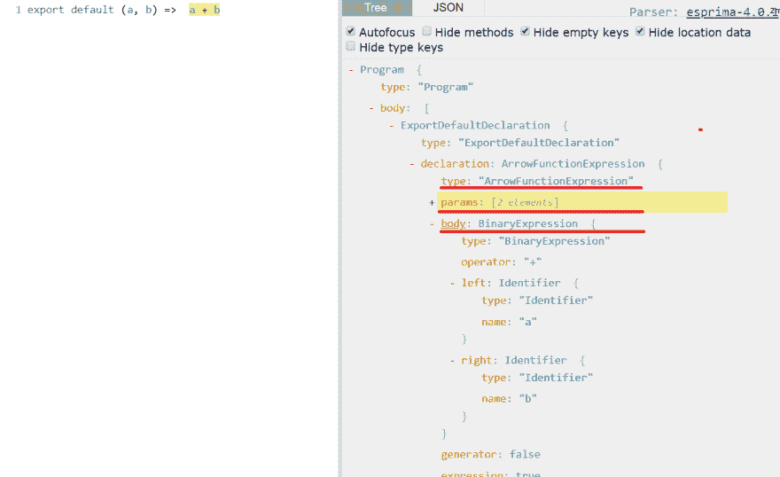
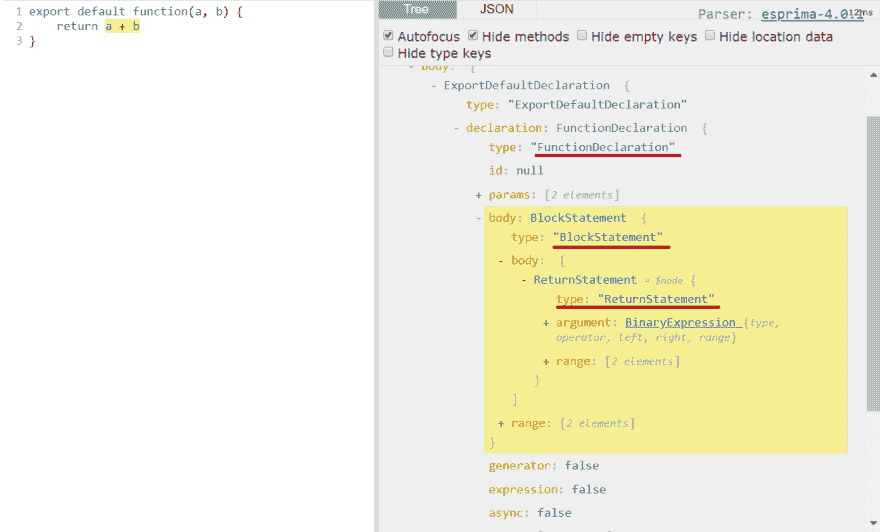

# 编写 Javascript 代码模块并轻松理解 AST

> 原文：<https://dev.to/arminaskatilius/writing-javascript-codemods-and-understanding-ast-easily-48fc>

> 最初发布在我的[个人博客](https://katilius.dev/writing-js-codemods/)

使用静态类型语言的一大优势是易于重构。不同的 IDE 工具可以很容易地在数百个文件中使用数百种用法来重命名类或方法。鉴于 Javascript 的性质，一些重构是困难的，甚至是不可能的。

尽管如此，修改或检查 Javascript 代码的不同工具仍然层出不穷。在某些情况下，它们甚至比静态类型语言生态系统中的还要好。更漂亮的，**诚品**，**反应码模块**等等。

它们都有一个共同点——它们都分析或修改被解析的代码的抽象语法树。基本上，AST 允许您使用树结构遍历源代码。AST 是一个通用编程语言术语，并不特定于 Javascript。我不会在这里深入研究 AST 的理论，但是我将展示一个如何使用它的具体例子。

## 值得注意的工具和库

*   AST Explorer -学习时最有用的工具之一。粘贴 JS 代码，可以看到不同 AST 规范中的 AST 表示。
*   jscodeshift -脸书开发的工具，帮助编写代码修改脚本。
*   [AST Types](https://github.com/benjamn/ast-types/)-jscodeshift 所基于的类型规范。
*   react-codemod -脚本集合，为 jscodeshift 编写，以不同的方式转换 react 代码。有一些很好的例子可以参考。
*   js-codemod -类似的脚本集合，不是 React 特定的。还有，帮助学习以身作则。

## 为 TDD 工作流设置 codemod 项目

Codemod 是 TDD 工作的教科书示例。你有一个输入文件，你运行脚本，你得到输出。因此，我强烈建议对 codemod 项目使用 TDD。它不仅使 codemods 更加稳定，而且让项目具有测试工作流设置，将有助于您的学习。因为你可以通过反复运行相同的测试来进行实验。

下面是如何从头开始创建 codemod 项目:

1.  创建空 npm 项目(`npm init sample-codemod`)
2.  安装代码转换`npm i -S jscodeshift`
3.  安装笑话`npm i -S jest`
4.  从 jscodeshift 库 [src/testUtils.js](https://github.com/facebook/jscodeshift/blob/595b15cda4f52673cad8fe3ae65c12e334966dbf/src/testUtils.js) 中复制测试工具
5.  修改`testTest.js`，将`require('./core')`替换为`require('jscodeshift')`
6.  创建初始文件夹结构:

```
+-- src
|   +-- __testfixtures__  - put sample files for transformation, use suffixes .input.js and .output.js
|   +-- __tests__ -simplicity-in-technology.markdown 
```

之后，您可以创建一个测试文件并开始添加测试。来自`jscodeshift`的测试工具允许你创建 2 个类型测试:

*   内联，其中输入和输出被定义为字符串`defineInlineTest(transformFn, options, input, output)`
*   使用文件，在这里定义输入和输出文件的路径`defineTest(__dirname, transformName, options, testFilePrefix)`

我在 Github 中用这个样本创建了一个 repo。

## 创建 codemod 的步骤

本质上，codemods 可以简化为两个步骤:

1.  找到树节点
2.  用新的替换或修改

因为用 JS 写同样的逻辑有很多种方法。你需要想出开发者可以写出你想要替换的东西的所有方法。例如，即使找到导入的价值也不是那么简单。您可以使用`require`代替`import`，您可以重命名指定的导入，您可以多次执行相同的导入语句，等等。

开始时，我建议只考虑最简单的情况，不要考虑边缘情况。这就是为什么我认为 TDD 是必不可少的，你可以逐渐增加更复杂的情况，同时不破坏最初的功能。

## 样本代码 mod

让我们使用这个工作流编写简单的 codemod。首先让我们定义一个简单的测试用例，因为我们正在尝试使用 TDD。

我们想转换这个:

```
export default (a, b) => a + b; 
```

成:

```
export default function (a, b) {
  return a + b;
} 
```

如果我们对 jscodeshift 使用文件方法。可以这样定义:

```
describe('arrow-to-function', () => {
    defineTest(__dirname, 'arrow-to-function', null, 'defaultExportedArrow');
}); 
```

一旦我们有了这个样本，我们就可以启动 [AST Explorer](https://astexplorer.net/) 并检查如何将输入代码解析为 AST(确保您使用了 esprima 规范):

[](https://res.cloudinary.com/practicaldev/image/fetch/s--lJUUccJd--/c_limit%2Cf_auto%2Cfl_progressive%2Cq_auto%2Cw_880/https://thepracticaldev.s3.amazonaws.com/i/zm28eoi504t24vic5a34.png)

从 explorer 中可以清楚地看到，我们需要找到类型为`ArrowFunctionExpression`的节点。基于突出显示，我们关心箭头功能`body`和`params`字段。
在分析了要查找的内容之后，我们还需要找出我们需要构建的内容，在这里 AST explorer 也有帮助。只需将输出代码粘贴到其中:

[](https://res.cloudinary.com/practicaldev/image/fetch/s--DSrHYwpT--/c_limit%2Cf_auto%2Cfl_progressive%2Cq_auto%2Cw_880/https://thepracticaldev.s3.amazonaws.com/i/1hqhiz38wur7n5d98lz9.png)

从结构上看，很明显，常规函数要复杂一些。我们需要添加一个 block 语句和 return 语句。

让我们从寻找箭头函数开始。要创建 codeshift 转换，您需要创建文件并导出单个函数。该函数将接收三个参数:fileInfo、API、options。目前我们最关心的是`api.jscodeshift`(通常定义为`j`)和`fileInfo`。找到所有的箭头功能很简单:

```
module.exports = function transform(file, api) {
  const j = api.jscodeshift;

  j(file.source).find(j.ArrowFunctionExpression);
}; 
```

这将返回集合实例，我们可以迭代和替换节点。让我们用常规函数替换所有的箭头函数:

```
module.exports = function transform(file, api) {
  const j = api.jscodeshift;

  return j(file.source)
    .find(j.ArrowFunctionExpression)
    .replaceWith(p => {
      const nodeValue = p.value; // get value from NodePath

      // whole node will be replaced with newly built node:
      return j.functionDeclaration(
        j.identifier(""),
        nodeValue.params,
        j.blockStatement([j.returnStatement(nodeValue.body)])
      );
    })
    .toSource();
}; 
```

*   每一项都是`NodePath`的一个实例，这允许您获取父节点，因此为了访问实际节点，您需要使用`p.value`字段。
*   如果访问以**大写**开头的 jscodeshift 字段，它将返回 type ( `j.ArrowFunctionExpression`)。它用于过滤和检查节点。
*   如果您访问以**小写**开头的 jscodeshift 字段，它将返回构建实例。这允许创建代码块。检查 [AST Types](https://github.com/benjamn/ast-types/) repo，查看每个构建器支持哪些字段。例如，如果你打开`core.ts`文件并寻找`FunctionExpression`，它有如下定义:`build("id", "params", "body")`。这意味着您需要传递 id、params 和 body。

差不多就是这样。如果遵循这些步骤，编写更复杂的 codemod 并不是那么困难。只要不断检查 **AST Explorer** ，你就会逐渐熟悉它的结构。

### 进一步改进

当前的实现是非常幼稚的，**不应该在实际的代码库**上运行。然而，如果你想进一步学习这个例子，这里有一些建议:

*   用块语句`{}`处理箭头函数
*   不要转换调用`this`的箭头函数。箭头函数处理`this`的方式不同，当前的 codemod 会破坏工作代码。
*   将箭头函数声明转换成命名函数，例如`const sum = (a, b) => a + b`可以转换成命名函数`function sum(){...}`

### 运行在代码库上

我之前提到过，这段代码不应该在真实的代码库上运行，但是，如果你想构建完全工作的 codemod，下面是运行它的方法:

```
npx jscodeshift -t script-path.js pathToFiles 
```

### 处理复杂事物

*   提取自定义谓词。例如，如果你和 JSX 有很多交易，你可以创建像`hasJsxAttribute`、`isNativeElement`这样的谓词。
*   提取生成器函数。如果您一直在创建导入语句，请创建一个函数来返回带有导入语句的节点。

### 使用打字稿

如果您不熟悉 jscodeshift API，那么在使用它时需要猜测一下。Typescript 可以简化这个过程，它与本文开头提到的 **AST Types** 一起工作。有了 Typescript，猜测在构建器中使用什么参数，或者如何访问某些值就变得更容易了。然而，由于解析实际上是动态的，通过获取类型信息节省的时间有时会浪费在处理 Typescript 类型系统和手动定义类型上。

## Jscodeshift 菜谱

在这里，我将分享一些代码片段，这可能有助于您在编写自己的 codemod 时完成一些任务。它们不是 100%容易出错，但至少它们显示了您可以做的一些不同的修改。

### 创建函数调用语句

```
// will generate this:
const result = sum(2, 2);

j.variableDeclaration('const',
    [j.variableDeclarator(
      j.identifier('t'),
      j.callExpression(j.identifier('result'), [j.literal(2), j.literal(2)])
    )]
  ); 
```

### 在文件中查找导入

```
function findImportsByPath(j, root, importPath) {
    const result = {
        defaultImportUsed: false,
        namedImports: []
    };
    root.find(j.ImportDeclaration, (node) => node.source.value === importPath)
        .forEach(nodePath => {
            nodePath.value.specifiers.forEach(specifier => {
                if (j.ImportDefaultSpecifier.check(specifier)) {
                    result.defaultImportUsed = true;
                } else {
                    // specifier interface has both local and imported fields
                    // they are the same unless you rename your import: import {test as b}
                    result.namedImports.push(specifier.imported.name)
                }
            })
        });
    return result;
} 
```

### 重命名 JSX 属性

```
function transform(file, api) {
    const j = api.jscodeshift;

    return j(file.source)
        .find(j.JSXAttribute, n => n.name.name === 'class')
        .forEach(nodePath => {
            nodePath.node.name = 'className'
        }).toSource();
} 
```