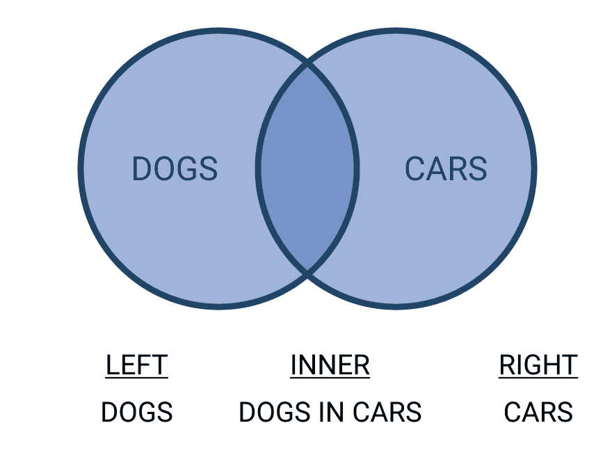
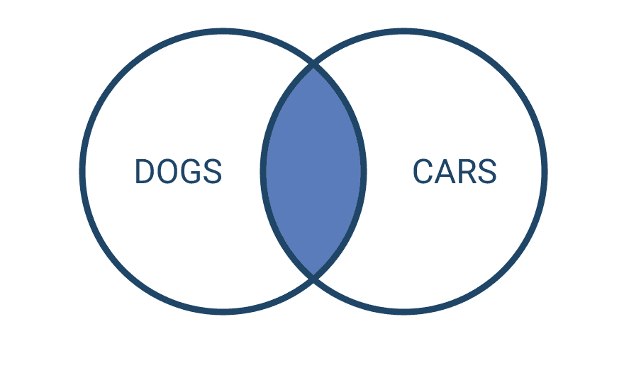
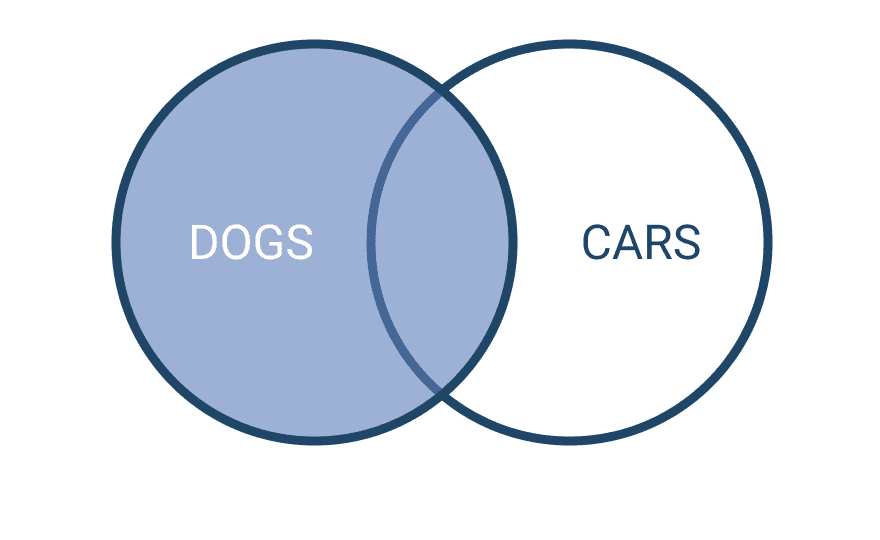
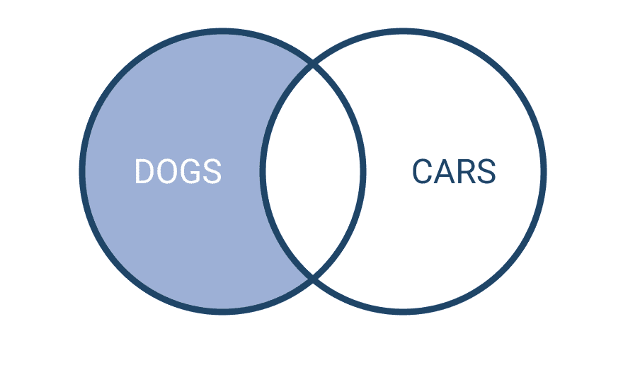
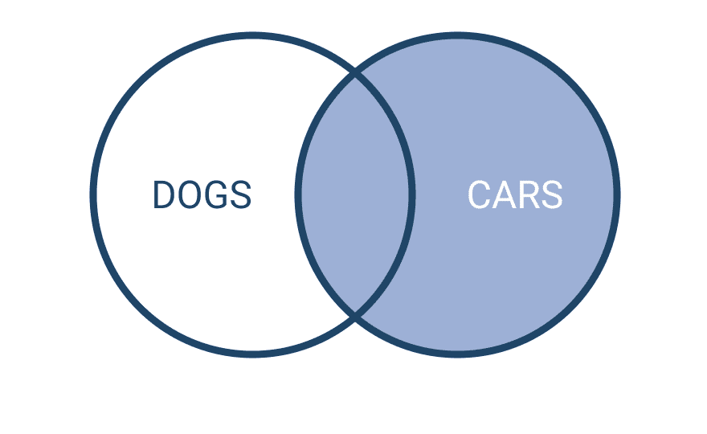
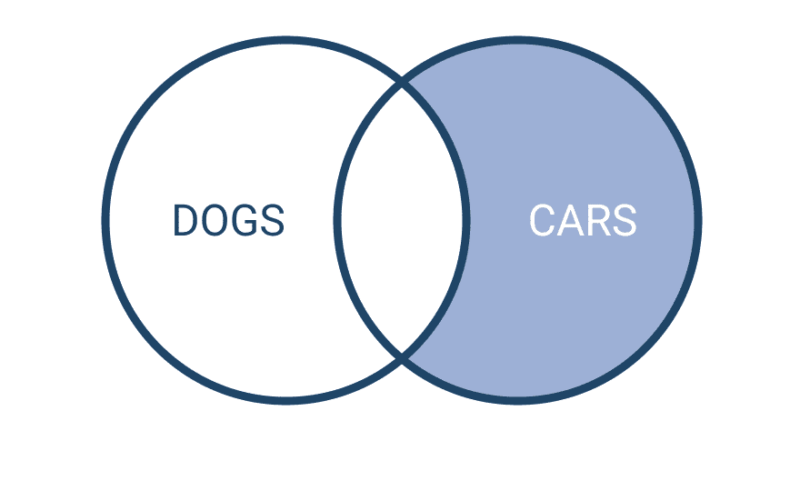
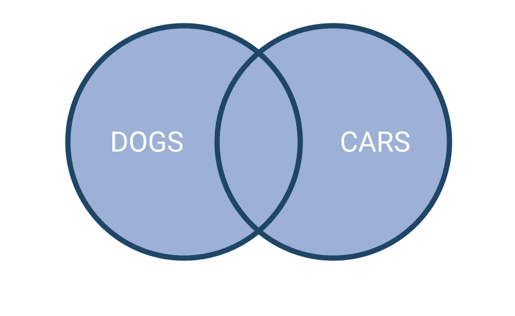
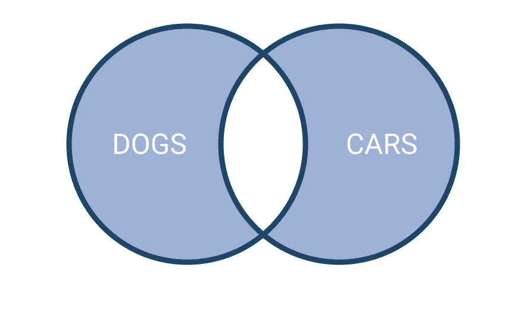

# 用 SQL 编写联接

> 原文：<https://dev.to/sebsanzdesant/writing-joins-in-sql-2jof>

在熨斗学校的第二周，我们直接跳到了 SQL。我渴望了解更多关于 SQL 的知识，因为我有运行 Wordpress 网站的经验，比如我共同创立的艺术家常驻项目 [Residency Unlimited](http://residencyunlimited.org) 。

我花了不健康的时间搜索 SQL 查询来弄清楚，例如，如何在 phpMyAdmin 中[将单个帖子从一个帖子类型分配到另一个](https://stackoverflow.com/questions/12090643/is-it-possible-to-convert-wordpress-custom-post-type-to-normal-categories)(然后再返回，讨厌！).

随着对数据库及其通过 SQL 的管理的深入了解，我发现更容易掌握面向对象的编程，并且特别重视[活动记录](https://guides.rubyonrails.org/active_record_basics.html#crud-reading-and-writing-data)如何简化数据库和代码之间的过程。

数据库本身就像油箱一样令人兴奋，但没关系，它们不需要令人兴奋。它们的目的是保存我们的汽车运行所需的燃料(在我们的例子中是内容)。SQL 是一种将汽油从油箱输送到发动机的方法。

让我们通过观察以下情况来深入研究 SQL 连接:

[](https://res.cloudinary.com/practicaldev/image/fetch/s--J8tcGSmL--/c_limit%2Cf_auto%2Cfl_progressive%2Cq_auto%2Cw_880/https://cdn-images-1.medium.com/max/1024/1%2ADF0XIwYg7Q869rfaEnCPOQ.jpeg)

该图向我们展示了如何将连接应用到上述场景中。

[](https://res.cloudinary.com/practicaldev/image/fetch/s--iQNDUT0W--/c_limit%2Cf_auto%2Cfl_progressive%2Cq_auto%2Cw_880/https://cdn-images-1.medium.com/max/880/1%2AtkL0F_oELYKwwCxlrgbGXg.png)

SQL 中的一个 JOIN 通过这三个部分的标识从多个表中返回行:INNER、LEFT 和 RIGHT。

让我们看看不同的连接类型是如何做不同的事情的。

### 内部连接

[](https://res.cloudinary.com/practicaldev/image/fetch/s--avts1Is8--/c_limit%2Cf_auto%2Cfl_progressive%2Cq_auto%2Cw_880/https://cdn-images-1.medium.com/max/880/1%2ARoq-OQxi010NUBWh36AQgA.png)

内部联接—或简称联接，可用于查找两个表之间的匹配。两个表需要共享一个键。这个密钥用于进行匹配。不匹配的结果被丢弃。

```
SELECT \*
FROM TableD Dogs 
INNER JOIN TableC Car
ON Dogs.key = Car.key; 
```

Enter fullscreen mode Exit fullscreen mode

### 左连接

[](https://res.cloudinary.com/practicaldev/image/fetch/s--wlS85gfJ--/c_limit%2Cf_auto%2Cfl_progressive%2Cq_auto%2Cw_880/https://cdn-images-1.medium.com/max/880/1%2AT4IoI65u3nBn2keU0vSm8A.png)

左连接-返回左表中的所有行，以及右表中的匹配行。

```
SELECT \*
FROM TableD Dogs 
LEFT JOIN TableC Cars
ON Dogs.key = Cars.key; 
```

Enter fullscreen mode Exit fullscreen mode

[](https://res.cloudinary.com/practicaldev/image/fetch/s--g62wYZty--/c_limit%2Cf_auto%2Cfl_progressive%2Cq_auto%2Cw_880/https://cdn-images-1.medium.com/max/880/1%2A6gZu4qf-c-3bWWgZ7DXogg.png)

您还可以添加一个 WHERE 子句，只返回外部部分的行:

```
SELECT \*
FROM TableD Dogs 
LEFT JOIN TableC Cars
ON Dogs.key = Cars.key
WHERE Cars.key IS NULL; 
```

Enter fullscreen mode Exit fullscreen mode

### 右加入

[](https://res.cloudinary.com/practicaldev/image/fetch/s--Px4RkvW4--/c_limit%2Cf_auto%2Cfl_progressive%2Cq_auto%2Cw_880/https://cdn-images-1.medium.com/max/880/1%2AlYwaXVtrx1Wt6U-V0ILbQQ.png)

右连接-与左连接相同，但方向相反。返回右表中的所有行，以及左表中的匹配行。

```
SELECT \*
FROM TableD d 
RIGHT JOIN TableC c
ON c.key = d.key; 
```

Enter fullscreen mode Exit fullscreen mode

[](https://res.cloudinary.com/practicaldev/image/fetch/s--qs2LIs66--/c_limit%2Cf_auto%2Cfl_progressive%2Cq_auto%2Cw_880/https://cdn-images-1.medium.com/max/880/1%2AQ90C8gmhlxnygy7L5hR9aQ.png)

和前面的例子一样，只返回外部的行。

```
SELECT \*
FROM TableD Dogs 
RIGHT JOIN TableC Cars
ON Dogs.key = Cars.key
WHERE Dogs.key IS NULL; 
```

Enter fullscreen mode Exit fullscreen mode

### 全外连接

[](https://res.cloudinary.com/practicaldev/image/fetch/s--I7gq6U6r--/c_limit%2Cf_auto%2Cfl_progressive%2Cq_auto%2Cw_880/https://cdn-images-1.medium.com/max/880/1%2ASPde8BXaYD697DMciPZhAw.png)

完全外部联接-当其中一个表中存在匹配时，返回所有行。

```
SELECT \*
FROM TableD Dogs 
FULL OUTER JOIN TableC Cars
ON Dogs.key = Cars.key; 
```

Enter fullscreen mode Exit fullscreen mode

[](https://res.cloudinary.com/practicaldev/image/fetch/s--pv8xwZ8X--/c_limit%2Cf_auto%2Cfl_progressive%2Cq_auto%2Cw_880/https://cdn-images-1.medium.com/max/880/1%2AFkWYT9uS6h0TkJkH81Gd3g.png)

只需要外部连接，不包括内部连接？

```
SELECT \*
FROM TableD Dogs 
FULL OUTER JOIN TableC Cars
ON Dogs.key = Cars.key
WHERE Dogs.key IS NULL
OR Cars.key IS NULL; 
```

Enter fullscreen mode Exit fullscreen mode

### 这个为什么重要？

体现了干(不要重复自己)法则。

仅在每个查询上使用内部联接会返回唯一的匹配，而丢弃任何不匹配的条目。没办法知道哪些狗没坐过车，或者哪辆车没坐过狗。当你需要的时候，你很快就会发现自己在来回寻找特定的信息。

使用左连接、右连接或全连接可以一下子提供更多的细节，从而更快地了解数据库包含的内容及其内容之间的关系。

### 其他加入

SQL 中还有其他运算符可以帮助您解析行。例如，使用 CROSS 会将所有内容与所有内容连接起来，而 UNION 会将两个查询的结果连接到一列中，并删除重复的条目。

在 W3schools 上查看 [SQL 定义，并在 Hack Array 上尝试您的](https://www.w3schools.com/sql/sql_join.asp)[加入技能。](https://www.hackerrank.com/domains/sql?filters%5Bsubdomains%5D%5B%5D=join)