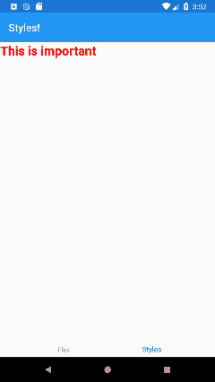
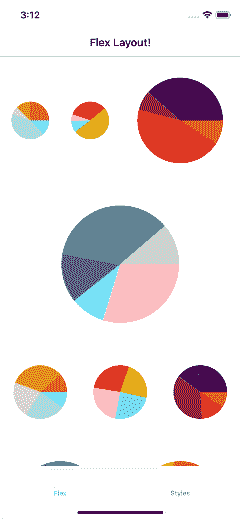
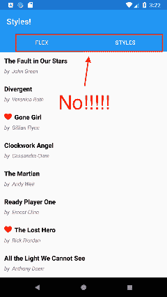
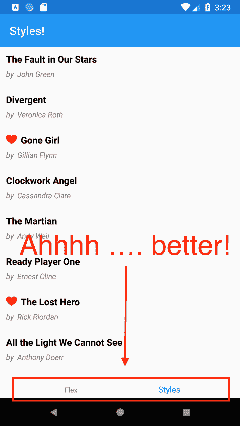

# Xamarin。给你和我的表格 3

> 原文：<https://dev.to/progresstelerik/xamarinforms-3-for-you-and-me-570m>

本文深入探讨了 Xamarin 中一些令人兴奋的新特性。Forms 3.0 版本以及开发人员如何在 Xamarin 应用程序中利用它们。

大多数开发人员对软件真正感到兴奋。现代软件主宰世界，开发者塑造未来。开发人员经常不能等待下一个热点的到来——他们选择的平台和工具。众所周知，开发者总是走在前沿，渴望尝试最新的技术。这带来了显而易见的风险，即阻塞计算机或浪费时间让东西工作——但是，嘿，新软件就是很酷。

然而，作为一名专业软件 Developer™️的现实往往会带来谨慎。开发人员对未测试的热点保持警惕，因为开发环境/工具很容易出错。在这种困境中，出现了新的 Xamarin。表单 3.0 版本。

虽然还是相当新的，Xamarin。Forms 3.0 已经显示出惊人的成熟——现有的功能可以工作，而期待已久的新功能给开发者带来了快乐。一直以来。Forms 3 版本展示了稳定性，从而降低了开发人员采用的门槛。

但是 Xamarin 能做什么？Forms 3.x 为开发者做的？本文介绍了一些新特性，开发人员应该会发现将这些新特性集成到他们的 Xamarin 应用程序中非常有用。您可以在享受平台稳定性的同时体验最新、最棒的产品——有什么损失呢？

## 层叠样式表

不会吧。说不是这样的。CSS 的黑魔法已经找到了进入我们心爱的 Xamarin 的方法。表格？

> 关上前门！

是的，这是很多人的第一反应。NET 开发人员。但关键是 XAML 的 CSS 样式是可选的，实际上工作得很漂亮。像 Xamarin 中的 CSS 一样，习惯于为 web 构建的开发人员不需要学习任何新东西。表单遵循相同的规则。CSS 解析正在走向成熟，像 LESS/SASS 这样的预处理程序也可能被使用。

在 Xamarin 中使用 CSS。表单，开发人员只需创建一个带有*的文件。css 扩展并开始编写普通的 CSS。

```
.importantStuff {
    font-size: 24;
    font-style: bold;
    color: #FF0000;
}

#individId {
    margin: 10 0 0 10;
}

label, button {
    background-color: #c0d6f9
} 
```

看看这个。CSS 指定了类、单个元素 id 和整个元素类型。设置属性值的方式与普通的旧 CSS 相同。

在 CSS 上卖，迫不及待要用？很好——这就是你如何在 Xamarin.Forms 的 XAML 文件中使用一个单独的 CSS 文件

```
<ContentPage.Resources>
    <StyleSheet Source="PATH TO CSS RELATIVE TO XAML PAGE">
</ContentPage.Resources>

<ContentPage.Content>
    <Label Text="This is important" StyleClass="importantStuff">
</ContentPage.Content> 
```

[](https://res.cloudinary.com/practicaldev/image/fetch/s--4X58tUDu--/c_limit%2Cf_auto%2Cfl_progressive%2Cq_auto%2Cw_880/https://d585tldpucybw.cloudfront.net/sfimages/default-source/default-album/cssstyles.tmb-small.png%3Fsfvrsn%3Ddeacfe81_2)

这个例子展示了如何加载 CSS，然后将一个类应用到一个`Label`控件。Xamarin 中的 CSS。表单已经存在，如果是为 web 和移动构建的，您现在可以开始共享样式了。在 Xamarin 中找到更多关于 CSS 的信息。表格[与文件](https://msou.co/bof)！

## 柔性布局

这听起来可能有点像网络上的`FlexBox`——而且理由很充分！Xamarin。Forms 最新的布局渲染`FlexLayout`实际上是受 CSS 中的`FlexBox Layout`的启发。因此 FlexLayouts 背后的想法是给容器(或布局)许多不同的(灵活的)选项来布局其子元素，以最好地填充可用空间。

> 你可能在想——太棒了，多给我看看！

这里是关于`FlexLayout`最好的事情——利用它所有可爱的布局选项就像给它添加控件一样简单，然后调整`Layout`上的一些属性和控件上的一些附加属性(类似于你如何设置控件在网格`Grid.Row="3"`中的位置)。

让我们来看一个结合了 CSS 和一些`FlexLayout`优点的例子。让我们使用一些漂亮的[饼状图](https://www.telerik.com/xamarin-ui/chart)来看看这一点，这些饼状图内置了用于 Xamarin 的 [Telerik UI。Pro tip 开发者——你不需要在复杂的 UI 上重新发明轮子。Telerik UI 通过性能和灵活的 API 真正展示了每个控件背后的工程设计。](https://www.telerik.com/xamarin-ui)

**CSS:**

```
.chart {
    flex-basis: 25%;
    height: 100;
}

.third {
    flex-basis: 33.33%;
    height: 150;
}

.half {
    flex-basis: 50%;
    height: 200;
}

.full {
    flex-basis: 100%;
    height: 250;
} 
```

**XAML:**T2】

```
<FlexLayout Direction="Row" Wrap="Wrap" AlignItems="Center" AlignContent="Start" >

    <telerikChart:RadPieChart StyleClass="chart">
        <telerikChart:RadPieChart.Palette>
            <local:OrangePalette />
        </telerikChart:RadPieChart.Palette>
        <telerikChart:RadPieChart.BindingContext>
            <local:ChartViewModel />
        </telerikChart:RadPieChart.BindingContext>
        <telerikChart:RadPieChart.Series>
            <telerikChart:PieSeries RadiusFactor="0.8"
                                    ValueBinding="Value"
                                    ItemsSource="{Binding Data}" />
        </telerikChart:RadPieChart.Series>
    </telerikChart:RadPieChart>

    <telerikChart:RadPieChart StyleClass="chart">
        <telerikChart:RadPieChart.Palette>
            <local:BrightPalette />
        </telerikChart:RadPieChart.Palette>
        <telerikChart:RadPieChart.BindingContext>
            <local:ChartViewModel />
        </telerikChart:RadPieChart.BindingContext>
        <telerikChart:RadPieChart.Series>
            <telerikChart:PieSeries RadiusFactor="0.8"
                                    ValueBinding="Value"
                                    ItemsSource="{Binding Data}" />
        </telerikChart:RadPieChart.Series>
    </telerikChart:RadPieChart>

    <telerikChart:RadPieChart StyleClass="chart, half">
        <telerikChart:RadPieChart.Palette>
            <local:DarkPalette />
        </telerikChart:RadPieChart.Palette>
        <telerikChart:RadPieChart.BindingContext>
            <local:ChartViewModel />
        </telerikChart:RadPieChart.BindingContext>
        <telerikChart:RadPieChart.Series>
            <telerikChart:PieSeries RadiusFactor="0.8"
                                    ValueBinding="Value"
                                    ItemsSource="{Binding Data}" />
        </telerikChart:RadPieChart.Series>
    </telerikChart:RadPieChart>

   ...
   ... 
```

XAML 标记和 CSS 结合产生了这样的纵向布局:

[](https://res.cloudinary.com/practicaldev/image/fetch/s--rkNAf9id--/c_limit%2Cf_auto%2Cfl_progressive%2Cq_auto%2Cw_880/https://d585tldpucybw.cloudfront.net/sfimages/default-source/default-album/flexportrait.tmb-small.png%3Fsfvrsn%3Df5ed82e5_2)

在横向方向上是这样的:

[](https://res.cloudinary.com/practicaldev/image/fetch/s--GUhkJihF--/c_limit%2Cf_auto%2Cfl_progressive%2Cq_auto%2Cw_880/https://d585tldpucybw.cloudfront.net/sfimages/default-source/default-album/flexlandscape.png%3Fsfvrsn%3Da81fc9b3_1)

`FlexLayout`负责调整大小，确保所有东西都有足够的空间显示，不管我们的方向如何——多么漂亮。这适用于任何容器控件，不管它在视觉树中包含什么样的子控件。还有更多关于`FlexLayout`的内容——[查看文档](https://msou.co/bog)了解完整的故事。

## 安卓底部标签页

下一个 Xamarin。表单 3.0 特性应该贴上标签- *是时候了！*。在 Android 上，导航标签通常在顶部。但是让我们面对现实吧，iOS 告诉我们标签页的正确位置是在屏幕的底部。

[](https://res.cloudinary.com/practicaldev/image/fetch/s--0SOlH2GC--/c_limit%2Cf_auto%2Cfl_progressive%2Cq_auto%2Cw_880/https://d585tldpucybw.cloudfront.net/sfimages/default-source/default-album/droidtopnav.tmb-small.png%3Fsfvrsn%3D1e026d0e_2)

所以在 Xamarin。Forms 3，我们现在有办法把标签移动到屏幕底部，就像史蒂夫·乔布斯自己设计 Android 一样。

[](https://res.cloudinary.com/practicaldev/image/fetch/s--GO-Dg4QT--/c_limit%2Cf_auto%2Cfl_progressive%2Cq_auto%2Cw_880/https://d585tldpucybw.cloudfront.net/sfimages/default-source/default-album/droidbottomnav.tmb-small.png%3Fsfvrsn%3D1debed29_2)

让标签呈现在屏幕底部比你在 Android 中必须做的任何事情都要简单。

```
var tabsPage = new Xamarin.Forms.TabbedPage();
tabsPage.On<Xamarin.Forms.PlatformConfiguration.Android>().SetToolbarPlacement(ToolbarPlacement.Bottom); 
```

对-就是这样。Xamarin。表单——从 2014 年开始让 Android 开发变得可以忍受。

## 总结一切

现在，我们来了解一下 Xamarin 的一些新的和最好的特性。表格 3。

使用 CSS 对 XAML 控件和页面进行样式化已经成为一种趋势。当然这看起来有点奇怪。但是考虑到你可以使用所有你从网络世界辛苦获得的 CSS 知识，比如选择器和层叠规则，并将其应用于 Xamarin。表单——开始使用它几乎是不需要动脑筋的。同样，这是一个可选功能，开发者可以选择 XAML 风格或 CSS。

`FlexLayout`是另一个漂亮的小渲染特性。这是 Xamarin.Forms 从网络世界带来的第二个有价值的灵感。这一次，给一个`FlexLayout`布局添加一些控件——让布局为你计算所有东西应该出现在屏幕上的什么地方。开发者可以[了解](https://msou.co/bog)的布局选项有多灵活。

然后是 Android 底部标签——移动世界应该是什么样子。

总而言之，开发者绝对应该给 Xamarin。Forms 3 a spin -它很稳定，并提供了一些令人兴奋的新功能。站在前沿有一些令人敬畏的好处——也许你会如此倾向于期待 Xamarin。表单 4.0。为了未来！