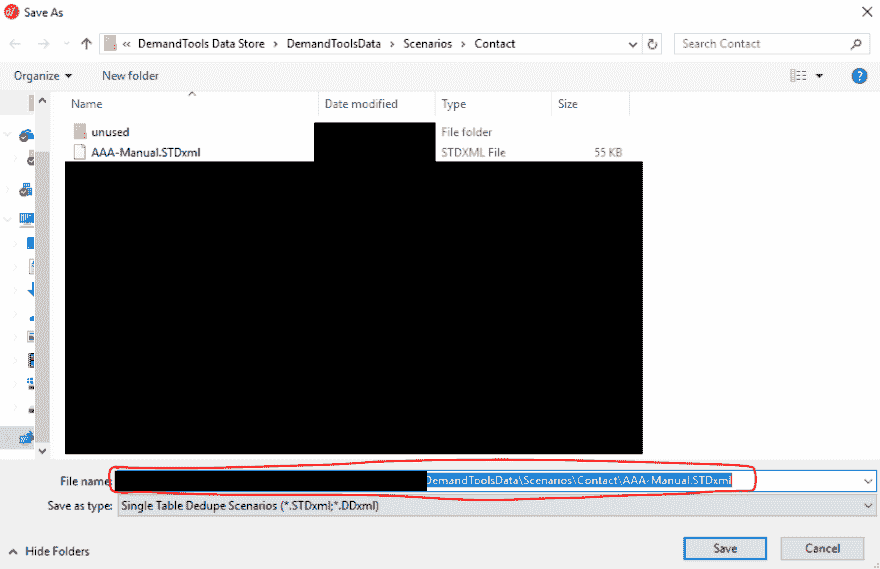
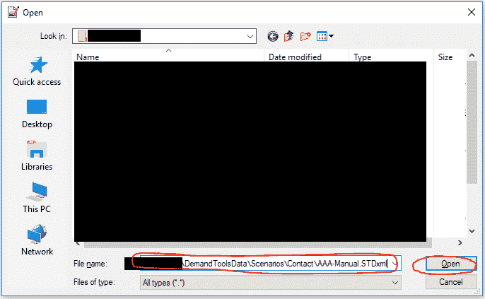
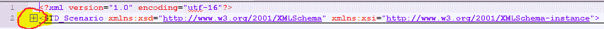
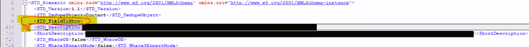

# 用于 Salesforce 管理员的 XML:需求工具配置

> 原文：<https://dev.to/katiekodes/xml-for-salesforce-administrators-demandtools-configuration-5a78>

正如我们[在 Salesforce 流程](https://dev.to/katiekodes/setting-up-vscode-to-edit-salesforce-metadata-126l)中看到的，在典型的点击式“业务逻辑工具”中复制和粘贴配置设置是能够读写 XML 的一个重要原因。

让我们来看另一个方便的“复制-粘贴”任务:确保 DemandTools 场景中*应该*有相同的组件*实际上做了*。

> **DEV FRIENDS:** 这篇文章不仅仅是针对 Salesforce 专业人员的！它实际上是关于编辑*任何*类型的基于 XML 的软件配置文件，不管有没有代码。最后还有一些美味的 Python 自动化。

* * *

## 我的问题

我怀疑我没有以前那么多的同行使用 Validity 的 [DemandTools](https://www.validity.com/demandtools/) 了，因为他们停止向中型和大型非营利组织免费提供他们的产品，但如果你的公司负担得起，这确实是一个在 Salesforce 组织内编辑数据的惊人工具。

它的一个更好的特性是能够将描述数据修改的设置保存为称为“场景”的文件。示例:

1.  在“MassImpact”模块中，可以一次编辑单个表中的大量记录，您可以保存这样的设置，“查找 Katie 拥有的联系人记录，并将它们更改为 Anush 拥有的记录。”这样，如果您需要再次进行相同类型的“批量数据修正”，您就不必重新设置规则。
2.  在“[单表重复数据删除](https://www.youtube.com/watch?v=IH3HycKGPNw)”模块中，用于查找与某些规则“匹配”的记录，并检查是否对其进行重复数据删除，以及执行重复数据删除，您可以保存“我的匹配规则是什么”、“检查建议的集合时，我希望虚拟检查哪些字段”等设置。这样，如果您每天都进行重复数据删除，就不必每天早上重新设置设置。

当我准备将我为重复数据删除创建的 DemandTools“场景”移交给一位将接管我工作的同事时，我注意到除了“匹配规则”的之外，它们几乎都是相同的

 *当然，50 个“我想虚拟检查的字段”的列表是我希望*无论我们使用 10 个“场景”中的哪一个都是相同的。*

也就是说，我的 10 个场景有点不同步，因为随着时间的推移，我手动编辑了一些场景，但留下了一些场景。

> *   **Q:** How can I make sure that all my 10 "scenarios" contain the exact same list of "fields to be reviewed" and that they are in the exact same order as each other, instead of dragging around in DemandTools all day? I hope they are beautiful and clean for my colleagues.
> *   **A:** XML and a text editor to save!

DemandTools **“场景”只是保存在硬盘上的大 XML 文件**-这意味着我们 Salesforce 管理员可以将它们编辑为明文，并更改 DemandTools 的行为方式。

* * *

## 手工编辑场景*(无编码)*

### 第一步:像往常一样确定一个场景，并记下它的“位置”

1.  开放需求工具
2.  在 DemandTools 中编辑*一个*场景，在 DemandTools 的“单表重复数据删除”模块的第一页右上方四分之一处的“ **[字段周围拖动字段，显示在“找到的重复项](https://helpconsole.validity.com/DemandTools/page.aspx?pageid=std_overview&nocache=11261#Step%202:%20Fields%20to%20Show)** ”部分，直到您满意为止。👍🏼
3.  点击**保存**
4.  在您单击弹出窗口中的“保存”按钮之前，请将“**文件名**”框中的完整文件路径复制到您的剪贴板，并将其粘贴到某个“安全”的位置，就像在 Microsoft 记事本或 Microsoft Word 中的新文档一样。T3】

### 第二步:从场景中复制文本

1.  打开 [Notepad++](https://notepad-plus-plus.org/) ，这是一个具有强大功能的文本编辑器，可以对具有高度结构化内容(如 XML)的文本文件进行“代码折叠”。
    *   (“代码折叠”意味着在左边空白处给你一个小小的“+”和“-”按钮，这样你就可以展开和隐藏文档中自然“聚集”在一起的部分。)
2.  点击顶部菜单中的**文件**，然后点击**打开**
3.  将你复制的文件路径粘贴到“**文件名**框中，点击“打开”
4.  点击顶部菜单中的**查看**。
5.  点击**折叠所有**
6.  单击第 2 行中名为`STD_Scenario`的标签旁边的`+`符号。
7.  在 XML 的顶部附近，**select*****entire***`<STD_FieldToShow>...</STD_FieldToShow>`tagset*(也称为“元素”)*—所有几百行。
    *   我喜欢这样做，把我的光标放在这个标签集开始的那一行的开头*(包括任何缩进空格之前)*，然后按住“shift”并点击一次我的向下箭头。
8.  将复制到你的剪贴板上。

### 第三步:将“要显示的字段”粘贴到其他场景中

当然，在这一步，你要非常小心，不要粘贴错误的内容。

(但是，嘿，这就是为什么你[学会了如何阅读 XML](https://dev.to/katiekodes/intro-to-xml-and-json-3-xml-items-keys-5896) ，对吗？所以你可以像外科手术一样精确地完成这种手术？)

**注意:**如果你担心你可能会搞砸这一步，在真正编辑它们之前，备份你将要编辑的每个文件！

1.  一次一个，**打开剩余的`.STDxml`**场景定义文件中的每一个**，这些文件位于你硬盘上的同一个文件夹** *(对我来说是“联系人”)*，作为你在 Notepad++中复制`STD_FieldToShow`的场景。
2.  对于每一个，做"**查看**->-**折叠所有**，展开"`STD_Scenario`"标签。
3.  对于每一个，**选择*****整个*** `<STD_FieldToShow>...</STD_FieldToShow>`标签集**就像你在**之前做的一样，只是这一次，你选择它是因为你要粘贴它。像以前一样，确保都是几百行。
4.  **将从*第一个*场景中复制的替换内容**粘贴到您刚刚选择的文本上。
5.  **保存**您刚刚编辑的“`.STDxml`”场景文件，**关闭**。

### 第四步:Ta-Da！

1.  打开需求工具。
2.  **用 Notepad++打开**你**刚刚编辑**的一个场景。
3.  浏览“ **[”字段，以显示在第一页右上角的“找到的重复项](https://helpconsole.validity.com/DemandTools/page.aspx?pageid=std_overview&nocache=11261#Step%202:%20Fields%20to%20Show)** ”部分。
4.  它应该看起来**确切地说**在这个过程的开始，你如何点击设置你在 DemandTools 中编辑的那个。

* * *

### 故障排除

*   在开始之前，请务必复制您要编辑的场景，并将其保存在安全的地方。
*   如果当您试图打开一个场景时 DemandTools 抛出某种错误，那么您可能犯了一个错误。
    *   没什么大不了的。将您的备份文件复制/粘贴到您的“损坏的”DemandTools 场景所在的文件夹中，并重新开始。
*   如果一个场景看起来像它以前的样子，而不是您刚刚更改的样子:
    *   您确定您确实在记事本中保存了您的更改吗？
    *   您确定您确实编辑了代表该场景的正确文件吗？
    *   你确定你“复制自”的场景和你“复制到”的场景中的“字段列表”有区别吗？你的眼睛发花了吗？伸个懒腰，喝点水。🥛
*   如有任何问题，请随时[联系我](https://www.twitter.com/KatieKodes)。

* * *

## 这个还能怎么用？

所有的 DemandTools 场景都只是 XML 文件，所以你可以用任何你觉得有意义的方式来做。

当然，许多任务在 DemandTools 中多次点击会更简单，但是如果你四处看看，你可能会发现其他**伟大的“复制-粘贴”候选者**。

*( [请分享你的想法](https://www.twitter.com/KatieKodes)！)*

不知道从哪里开始你的冒险“四处打探？”试试看我的关于[学习阅读 XML 和 JSON](https://dev.to/katiekodes/intro-to-xml-and-json-56co) 的系列文章。

> **注意:**如果你对编写这个项目不感兴趣，你可以在这里停止阅读。

谢谢你的来访。

我希望这能让您更好地了解理解 XML 能在多大程度上加快您工作中“枯燥”的部分。

* * *

* * *

## 用代码编辑场景

这真的会是我的博客吗，没有点头，就像他们说的，“自动化无聊的东西？”

我们刚刚讨论了“循环”10 个文件，寻找提到“`STD_FieldToShow`”的行，或者将中间的所有内容复制到我们的剪贴板，或者将中间的所有内容覆盖到我们的剪贴板内容。

这里有一些做同样事情的 Python！

Python 以其初学者友好性而闻名，所以如果你已经成为一名复制粘贴专家，并且想把你最无聊的工作写出来，[在你的计算机](https://dev.to/katiekodes/setting-up-python-on-windows-with-anaconda-3c8n)上安装一个设置，并尝试使用下面的代码。

> **安全步骤:**我只是让我的程序将新文件写到我电脑上的另一个文件夹，而不是我找到它们的那个文件夹，而不是备份我们将要编辑的文件 *( `C:\example\myoutput` )* 。
> 
> 如果我抽查输出并且喜欢我所看到的，我总是可以手动地将它们复制并粘贴到 DemandTools 场景设置文件实际所属的文件夹中。
> 
> (我用一个叫做“比较”的记事本++插件来帮助我验证我的“之前”&“之后”文件之间的区别。)
> 
> 请——在用代码编辑硬盘上的文件时，永远不要覆盖你的“原始”文件，并且你对你所做的事情不是 200%满意。
> 
> 你可以“摧毁重要的东西”，就像你可以“自动化无聊的东西”一样快——计算机不在乎你告诉它做哪一件事。🤖

### 算法(代码配方)

我们的代码是这样做的:

1.  打开具有“良好”字段显示列表的场景文件，构建一个 [Python 列表](https://www.w3schools.com/python/python_lists.asp)，文件的每一行都在列表的一个单独元素中。叫`copyFileLinesList`。
    *   请注意，文件夹中有两个反斜杠。
    *   在 Python 中键入文本时，反斜杠是特殊的，所以您必须将两个放在一行中，以表示单个反斜杠。
2.  编写一些有趣的代码，获取第一次出现的`STD_FieldToShow`开始和结束标签的【indexes】*(行号，文件的第一行是`0` )* 。我们将它们保存为`copyFromBegIndex`和`copyFromEndIndex`。
3.  提取“文件的行”的相关子列表，并保存为`copiedSublist`。
4.  在我们的“好”文件来自的同一个文件夹中循环所有场景文件，跳过我们的“好”文件。在这个循环中，对于每个文件:
    *   编写类似的代码来获取第一个`STD_FieldToShow`元素的开始/结束位置“索引”，并将其命名为`pasteOverBegIndex` / `pasteOverEndIndex`。
    *   提取一个“需要编辑的文件行”的子列表，它在我们的“要替换的块”之前*，并保存为`pasteHereFirstSublist`。*
    *   提取一个“需要编辑的文件行”的子列表，它位于我们的“要替换的块”的之后的*，并将其保存为`pasteHereLastSublist`。*
    *   构建一个名为`pasteHereNewList`的新列表，它由`pasteHereFirstSublist`、**、**和`pasteHereLastSublist`串联而成。 ***(看到我在那里做了什么吗？？！！)***
    *   将`pasteHereNewList`作为一个新文件写入磁盘的另一个文件夹*(注意不要覆盖我们正在“编辑”的实际文件，这样我们就有机会手动校对)*。

### 代码

这是代码本身:

```
import os

scenariosfolder = 'c:\\example\\DemandToolsData\\Scenarios\\Contact\\'
outputfolder = 'c:\\example\\myoutput\\'
filetocopy = 'ILoveThisScenario.STDxml'
openTagText = '<STD_FieldToShow'
closeTagText = '</STD_FieldToShow'

with open(scenariosfolder + filetocopy, 'r') as f:
    copyFileLinesList = f.readlines()

copyFromBegIndex = next((index for index,lineContents in enumerate(copyFileLinesList) if openTagText in lineContents)) # https://stackoverflow.com/a/40722453 and https://stackoverflow.com/a/9868665 copyFromEndIndex = next((index for index,lineContents in enumerate(copyFileLinesList) if closeTagText in lineContents))
copiedSublist = copyFileLinesList[copyFromBegIndex:copyFromEndIndex+1] # https://stackoverflow.com/a/3451199 
for filename in os.listdir(scenariosfolder):
    if filename.lower().endswith('.stdxml') and f != filetocopy:
        with open(scenariosfolder + filename) as f:
            pasteFileLinesList = f.readlines()
        pasteOverBegIndex = next((index for index,lineContents in enumerate(pasteFileLinesList) if openTagText in lineContents))
        pasteOverEndIndex = next((index for index,lineContents in enumerate(pasteFileLinesList) if closeTagText in lineContents))
        pasteHereFirstSublist = pasteFileLinesList[:pasteOverBegIndex]
        pasteHereLastSublist = pasteFileLinesList[pasteOverEndIndex+1:]
        pasteHereNewList = pasteHereFirstSublist + copiedSublist + pasteHereLastSublist
        with open(outputfolder + filename, 'w') as out_f:
            out_f.writelines(pasteHereNewList)
            #for x in pasteHereNewList: # https://stackoverflow.com/a/899176
                #out_f.write("%s\n" % x) # https://stackoverflow.com/a/899176 
```

#### 故障排除

如果输出文件被" smooshed "成一行，尝试用一个`#`在行首"注释掉"倒数第三行代码，并通过删除代码的前导`#`符号并再次运行来"取消注释"最后两行代码。

和往常一样，[有任何问题联系我](https://www.twitter.com/KatieKodes)——快乐编码，享受你提高的生产力 *( [希望是](https://xkcd.com/1319/) )* 。*