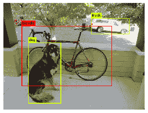

# 谷歌上的 YOLO

> 原文：<https://dev.to/0xkoji/yolo-on-google-colab-4b8e>

我曾经在 Mac 上使用 YOLO，速度非常慢(每秒 1-2 帧左右)，用一张图片测试需要一分钟。此外，花了几个小时才弄清楚我的 env 的问题。

我试着在 Google Colab 上运行 YOLO，因为我不想浪费时间来设置环境。

### 步骤

1.  git 克隆暗网
2.  制造
3.  下载重量
4.  运行 YOLO

下面是我在 Google Colab
[上的 jupyter 笔记本 https://Colab . research . Google . com/drive/1 xcso _ vzo 7 bckv 6 x _ qnylofwiueftwip 3](https://colab.research.google.com/drive/1XCsO_VZo7bCKv6x_QNYlOFwiuEFtwIP3)