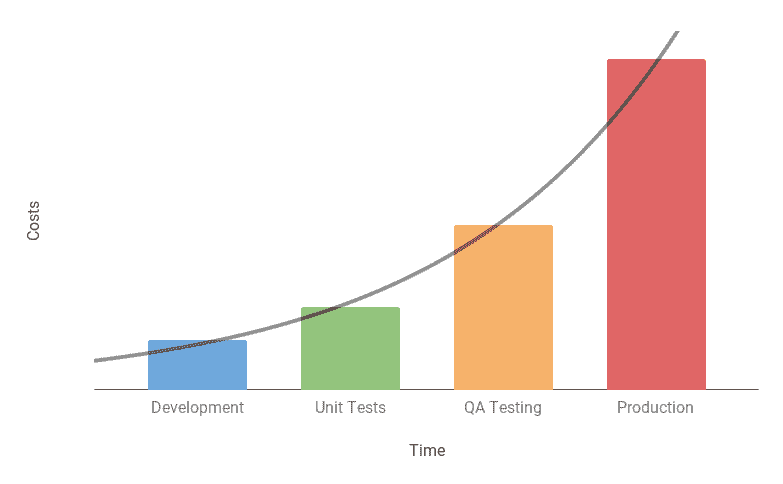

# 你不能测试产品的质量

> 原文：<https://dev.to/lastzero/you-can-t-test-quality-into-a-product-2lfo>

QA 测试和评审是在开发完成后进行的活动。您不能在构建功能之前测试它，也不能在编写代码之前检查代码。

越早发现潜在问题，管理缺陷和重新实现功能的开销就越低。

质量保证是从开发开始的积极主动的团队活动。它需要设计严密的反馈回路，以确保质量首先被构建到产品中。