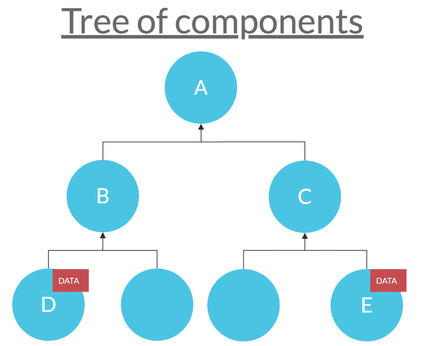
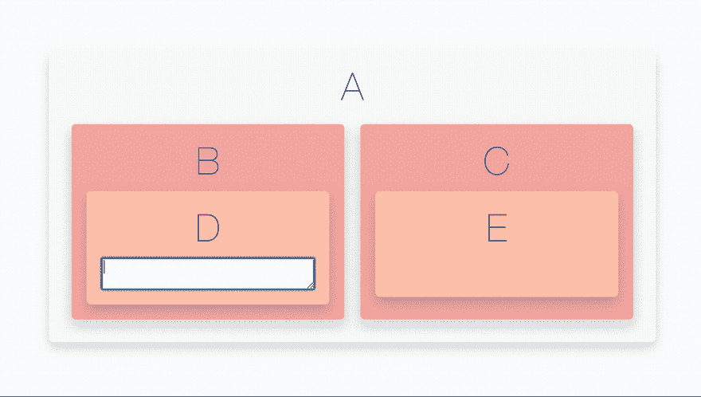
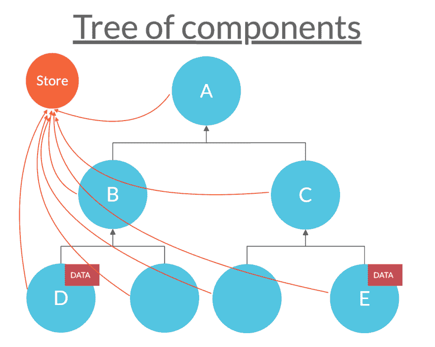

# 不一定要用 Redux

> 原文：<https://dev.to/anssamghezala/you-don-t-have-to-use-redux-32a6>

* * *

React 应用程序基本上是一个相互传递数据的组件树。在组件之间传递数据通常很容易。然而，随着应用程序树的增长，在保持良好可读代码库的同时传递数据变得越来越困难。

假设我们有以下树结构:
[](https://res.cloudinary.com/practicaldev/image/fetch/s--ODj86ijB--/c_limit%2Cf_auto%2Cfl_progressive%2Cq_auto%2Cw_880/https://thepracticaldev.s3.amazonaws.com/i/axnmkq4b19fxeso4lb7z.png) 
这里我们有一个简单的树，有 3 个层次。在这个树中，节点 D 和节点 E 都操作一些相似的数据:**假设用户在节点 D 中输入了一些文本，我们希望在节点 E 中显示这些文本**。
[](https://res.cloudinary.com/practicaldev/image/fetch/s--BvBmnS0u--/c_limit%2Cf_auto%2Cfl_progressive%2Cq_66%2Cw_880/https://thepracticaldev.s3.amazonaws.com/i/f30lljepc1kzgozol7xt.gif)

### *我们如何将数据从节点 D 传递到节点 E？*

本文介绍了解决这一问题的 3 种可能方法:

*   支柱钻井
*   Redux
*   React 的上下文 API

本文的目的是比较这些方法，并表明当涉及到解决一个常见的问题时，比如我们刚刚提到的问题，可以只使用 React 的上下文 API。

## 方法 1:支柱钻孔

一种方法是天真地将数据从子代传递到父代，然后通过道具从父代传递到子代，例如:D->B->A，然后 A->C->E

这里的想法是使用从子节点到父节点触发的`onUserInput`函数将输入数据从节点 D 传送到节点 A 的状态，然后我们将数据从节点 A 的状态传递到节点 e。

我们从节点 D 开始:

```
class NodeD extends Component {
  render() {
    return (
      <div className="Child element">
        <center> D </center>
        <textarea
          type="text"
          value={this.props.inputValue}
          onChange={e => this.props.onUserInput(e.target.value)}
        />
      </div>
    );
  }
} 
```

当用户输入内容时，`onChange`监听器将从 prop 中触发`onUserInput`函数，并传入用户输入。节点 D 属性中的函数将触发节点 B 属性中的另一个`onUserInput`函数:

```
class NodeB extends Component {
  render() {
    return (
      <div className="Tree element">
        <center> B</center>
        <NodeD onUserInput={inputValue => this.props.onUserInput(inputValue)} />
      </div>
    );
  }
} 
```

最后，当到达根节点 A 时，节点 B 属性中触发的`onUserInput`会将节点 A 中的状态更改为用户输入。

```
class NodeA extends Component {
  state = {
    inputValue: ""
  };

  render() {
    return (
      <div className="Root element">
        <center> A </center>
        <NodeB
          onUserInput={inputValue => this.setState({ inputValue: inputValue })}
        />
        <NodeC inputValue={this.state.inputValue} />
      </div>
    );
  }
} 
```

那个**输入值**然后会通过 props 从节点 C 传到它的子节点 E:

```
class NodeE extends Component {
  render() {
    return (
      <div className="Child element">
        <center> E </center>
        {this.props.inputValue}
      </div>
    );
  }
} 
```

它已经给我们的代码增加了一些复杂性，即使它只是一个小例子。你能想象当应用程序增长时会变成什么样吗？🤔

这种方法依赖于树的深度，因此对于更大的深度，我们需要遍历更大的组件层。这可能太长而无法实现，太重复，并且增加了代码的复杂性。

* * *

## 方法二:使用 Redux

另一种方法是使用像 Redux 这样的状态管理库。

> Redux 是 JavaScript 应用程序的可预测状态容器。我们整个应用程序的状态存储在一个存储区的对象树中，你的应用程序组件依赖于这个存储区。每个组件都直接连接到全局存储，并且全局存储的生命周期独立于组件的生命周期。

[](https://res.cloudinary.com/practicaldev/image/fetch/s--fuxmEqIK--/c_limit%2Cf_auto%2Cfl_progressive%2Cq_auto%2Cw_880/https://thepracticaldev.s3.amazonaws.com/i/5n276dibl7bxch5mls63.png)

我们首先定义应用程序的状态:我们感兴趣的数据是用户在节点 d 中键入的内容。我们希望节点 e 可以使用这些数据。为此，我们可以在我们的存储中使用这些数据。然后，节点 E 可以订阅它，以便访问数据。我们一会儿会回到商店。

### 第一步:定义减速器

接下来的事情是定义我们的减速器。我们的 reducer 指定了应用程序的状态如何改变以响应发送到存储的动作。我们这样定义我们的减速器块:

```
const initialState = {
  inputValue: ""
};

const reducer = (state = initialState, action) => {
  if (action.type === "USER_INPUT") {
    return {
      inputValue: action.inputValue
    };
  }
  return state;
}; 
```

在用户输入任何东西之前，我们知道我们状态的数据或 **inputValue** 将是一个空字符串。因此，我们用一个空字符串 **inputValue** 为缩减器定义了一个默认的初始状态。

> 这里的逻辑是，一旦用户在节点 D 中键入一些东西，我们“触发”或者更确切地说是**分派**一个**动作**，我们的 reducer 将状态更新为已经键入的任何内容。这里的“更新”不是指“突变”或改变当前状态，我是指**返回一个新状态**。

if 语句将基于其类型的调度操作映射到要返回的新状态。所以我们已经知道被调度的动作是一个包含类型键的对象。我们如何获得新状态的用户输入值？我们简单地将另一个名为**的键 inputValue** 添加到我们的 action 对象中，在我们的 reducer 块中，我们使新状态的 inputValue 具有带有`action.inputValue`的输入值。所以我们 app 的动作会遵循这个架构:

`{ type: "SOME_TYPE", inputValue: "some_value" }`

最终，我们的调度语句将如下所示:

`dispatch({ type: "SOME_TYPE", inputValue: "some_value" })`

当我们从任何组件调用 dispatch 语句时，我们传递动作的类型和用户输入值。

好了，现在我们对应用程序的工作原理有了一个概念:在我们的输入节点 D 中，我们发送一个类型为`USER_INPUT`的动作，并传入用户刚刚输入的值，在我们的显示节点 E 中，我们传入应用程序当前状态的值，也就是用户输入的值。

### 第二步:定义门店

为了使我们的存储可用，我们在从 react-redux 导入的一个`Provider`组件中传递它。然后我们把我们的应用程序包装在里面。因为我们知道节点 D 和 E 将使用该存储中的数据，所以我们希望我们的 Provider 组件包含这些节点的一个公共父节点，即根节点 A 或整个应用程序组件。让我们选择我们的应用程序组件来包含在我们的提供者中:

```
import reducer from "./store/reducer";
import { createStore } from "redux";
import { Provider } from "react-redux";

const store = createStore(reducer);
ReactDOM.render(
  <Provider store={store}>
    <App />
  </Provider>,
  document.getElementById("root")
); 
```

现在我们已经建立了我们的存储和 reducer，我们可以用我们的节点 D 和 E 弄脏我们的手了！

### 第三步:实现用户输入逻辑

让我们先来看看节点 d。我们感兴趣的是用户在`textarea`元素中输入了什么。这意味着两件事:

1-我们需要实现`onChange`事件监听器，并让它存储用户在存储中键入的任何内容。
2-我们需要`textarea`的值属性是存储在我们的存储中的值。

但是在做任何事情之前，我们需要设置一些东西:

我们首先需要将 node D 组件连接到我们的存储。为此，我们使用 react-redux 中的`connect()`函数。它向其连接的组件提供它需要的来自存储的数据片段，以及它可以用来向存储分派动作的函数。

> 这就是为什么我们使用两个`mapStateToProps`和`mapDispatchToProps`来分别处理商店的状态和发货。我们希望 node D 组件订阅我们的商店更新，就像我们应用程序的状态更新一样。这意味着任何时候应用程序的状态更新，`mapStateToProps`将被调用。`mapStateToProps`的结果是一个对象，它将被合并到我们的节点 D 的组件 props 中。我们的`mapDispatchToProps`函数允许我们创建被调用时分派的函数，并将这些函数作为道具传递给我们的组件。我们将通过返回新的函数来利用这一点，该函数调用传入一个动作的`dispatch()`。

在我们的例子中，对于`mapStateToProps`函数，我们只对*输入值*感兴趣，所以我们返回一个对象`{ inputValue: state.inputValue }`。对于`mapDispatchToProps`，我们返回一个函数`onUserInput`，它将输入值作为参数，并使用该值调度一个`USER_INPUT`类型的动作。由`mapStateToProps`和`onUserInput`函数返回的新的状态对象被合并到我们组件的道具中。所以我们这样定义我们的组件:

```
class NodeD extends Component {
  render() {
    return (
      <div className="Child element">
        <center> D </center>
        <textarea
          type="text"
          value={this.props.inputValue}
          onChange={e => this.props.onUserInput(e.target.value)}
        />
      </div>
    );
  }
}
const mapStateToProps = state => {
  return {
    inputValue: state.inputValue
  };
};

const mapDispatchToProps = dispatch => {
  return {
    onUserInput: inputValue =>
      dispatch({ type: "USER_INPUT", inputValue: inputValue })
  };
};
export default connect(
  mapStateToProps,
  mapDispatchToProps
)(NodeD); 
```

我们完成了节点 D！现在让我们转到节点 E，我们希望在这里显示用户输入。

### 第四步:实现用户输出逻辑

我们希望在这个节点上显示用户输入的数据。我们已经知道，这些数据基本上是我们应用程序的当前状态，就像我们的商店一样。所以最终，我们希望访问该商店并显示其数据。为此，我们首先需要使用与我们之前使用的相同的`mapStateToProps`函数来使用`connect()`函数为我们的节点 E 组件订阅商店的更新。之后，我们只需使用 **this.props.val** 这样:
T5】从组件的道具中访问商店中的数据

```
class NodeE extends Component {
  render() {
    return (
      <div className="Child element">
        <center> E </center>
        {this.props.val}
      </div>
    );
  }
}
const mapStateToProps = state => {
  return {
    val: state.inputValue
  };
};

export default connect(mapStateToProps)(NodeE); 
```

我们*终于*完成了 Redux！🎉你可以看看我们刚刚做的[这里](https://codesandbox.io/s/reduxtree-2n7ct?fontsize=14)。

在一个更复杂的例子中，比如一个树有更多共享/操作商店的组件，我们需要在每个组件上有两个`mapStateToProps`和`mapDispatchToProps`函数。在这种情况下，通过为每个动作类型和 reducers 创建一个单独的文件夹，将它们从组件中分离出来可能更明智。
*……谁的时间准？*

## 方法三:使用 React 的上下文 API

现在让我们使用上下文 API 重做同一个例子。
React[上下文 API](https://medium.com/r/?url=https%3A%2F%2Freactjs.org%2Fdocs%2Fcontext.html) 已经出现了一段时间，但直到现在 React 的版本 [16.3.0](https://reactjs.org/docs/context.html) 才变得可以安全地用于生产。这里的逻辑接近 Redux 的逻辑:我们有一个 context 对象，它包含一些我们希望从其他组件访问的全局数据。
首先，我们创建一个上下文对象，包含应用程序的初始状态作为默认状态。然后我们创建一个`Provider`和一个`Consumer`组件，如下所示:

```
const initialState = {
  inputValue: ""
};

const Context = React.createContext(initialState);

export const Provider = Context.Provider;
export const Consumer = Context.Consumer; 
```

> 我们的`Provider`组件将我们想要从中访问上下文数据的所有组件作为子组件。像上面 Redux 版本的`Provider`。为了提取或操作上下文，我们使用代表组件的消费者组件。

我们希望我们的`Provider`组件包装我们的整个应用程序，就像上面的 Redux 版本一样。然而，这个`Provider`与我们之前看到的略有不同。在我们的应用程序组件中，我们用一些数据初始化一个默认状态，我们可以通过我们的`Provider`组件共享这些数据。
在我们的例子中，我们共享 **this.state.inputValue** 以及一个操作状态的函数，比如我们的 onUserInput 函数。

```
class App extends React.Component {
  state = {
    inputValue: ""
  };

  onUserInput = newVal => {
    this.setState({ inputValue: newVal });
  };

  render() {
    return (
      <Provider
        value={{ val: this.state.inputValue, onUserInput: this.onUserInput }}
      >
        <div className="App">
          <NodeA />
        </div>
      </Provider>
    );
  }
} 
```

现在，我们可以继续使用我们的消费者组件:)
访问我们的`Provider`组件的数据，用户在节点 D 中输入数据:

```
const NodeD = () => {
  return (
    <div className="Child element">
      <center> D </center>
      <Consumer>
        {({ val, onUserInput }) => (
          <textarea
            type="text"
            value={val}
            onChange={e => onUserInput(e.target.value)}
          />
        )}
      </Consumer>
    </div>
  );
}; 
```

对于显示用户输入的节点 E:

```
const NodeE = () => {
  return (
    <div className="Child element ">
      <center> E </center>
      <Consumer>{context => <p>{context.val}</p>}</Consumer>
    </div>
  );
}; 
```

我们已经完成了这个例子的上下文版本！🎉没那么难吧。查看[此处](https://codesandbox.io/s/contextapiexample-wwqoc)
如果我们希望有更多的组件能够访问上下文呢？我们可以用提供者组件包装它们，并使用消费者组件来访问/操作上下文！*简单:)*

* * *

## 好吧，但是我该用哪一个呢

我们可以看到这个例子的 Redux 版本比我们的上下文版本花费了更多的时间。我们已经可以看到 Redux:

*   需要**更多的代码行**并且对于一个更复杂的例子(更多的组件来访问商店)来说可能太**【样板】**。
*   **增加复杂性**:在处理许多组件时，将你的 reducer 和 action 类型从组件中分离出来放在唯一的文件夹/文件中可能更明智。
*   介绍一个**学习曲线**:一些开发人员发现他们在努力学习 Redux，因为它需要你学习一些新概念:reducer、dispatch、action、thunk、中间件…

如果你正在开发一个更复杂的应用程序，并希望查看你的应用程序的所有调度操作的历史记录，那么“点击”其中的任何一个并跳转到该时间点，那么一定要考虑使用 Redux 的漂亮 dope [devTools 扩展](https://github.com/zalmoxisus/redux-devtools-extension)！

然而，如果您只对从一堆组件中访问一些全局数据感兴趣，您可以从我们的示例中看到，Redux 和 React 的上下文 API 都做了大致相同的事情。所以在某种程度上，*不一定要用 Redux！*