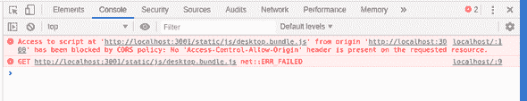

# 你不想把所有的鸡蛋放在一个篮子里:razzle 插件(二)

> 原文：<https://dev.to/nickcis/you-don-t-want-to-keep-all-of-your-eggs-in-one-basket-razzle-plugin-ii-25a5>

这是我做的第一个演讲的总结，叫做[*“No metas todo en la misma Bolsa:generando bundles por disposivo”*](https://www.meetup.com/es/React-js-en-Buenos-Aires/events/252948807/)(可以翻译成本文的标题)。

[](https://drive.google.com/file/d/1vnsMVslNssKV3W3Mv_i2ZwCa5Gh9GZp3/view)

**这是系列文章**的第二篇，我将解释如何将特定的设备逻辑封装到一个 Razzle 插件中:

*   [构建每个设备的捆绑包](https://medium.com/@nickcis/you-dont-want-to-keep-all-of-your-eggs-in-one-basket-building-bundles-per-device-887e21772453)
*   避免样板文件:开发一个 razzle 插件
*   *概括:开发一个 webpack 插件(wip)*

* * *

*TL；dr；这个想法是为了减少所需的样板文件，以便为每个设备提供特定的体验。*

这篇文章将更多地涉及代码，我将展示我如何将特定的设备逻辑封装到一个 razzle 插件中，以及我必须解决的所有问题。最后会有一个这个特性的工作实例。

[](https://res.cloudinary.com/practicaldev/image/fetch/s--oongQC9w--/c_limit%2Cf_auto%2Cfl_progressive%2Cq_auto%2Cw_880/https://nckweb.com.ar/static/9b523cda75fb576b26f8175c0310afb0/5979c/ralph-coleco.jpeg)

## 狂欢

嗯，首先，什么是 [Razzle](https://github.com/jaredpalmer/razzle) ？：

> 通用 JavaScript 应用程序很难设置。要么你买一个像 [Next.js](https://github.com/zeit/next.js) 或 [react-server](https://github.com/redfin/react-server) 这样的框架，叉一个样板文件，或者自己设置。Razzle 旨在填补这一空白，它是一种将 SSR 所需的所有复杂配置抽象为单一依赖项的工具——为您提供令人敬畏的 [create-react-app](https://github.com/facebookincubator/create-react-app) 开发体验，但随后将应用程序的其余架构决策(关于框架、路由和数据获取)留给您。通过这种方法，Razzle 不仅可以处理 React，还可以处理 Reason、Elm、Vue、Angular，最重要的是……接下来会发生什么。

简而言之，它是一个工具，让你专注于开发应用程序，而不是设置所有的 SSR 配置。我从 0.8 版本开始就一直使用它，我真的很喜欢它。版本 2.0 引入了插件来修改 webpack 的设置。最后一个功能将会被用到。

## 插件

[Razzle 插件](https://github.com/jaredpalmer/razzle#writing-plugins)是 Razzle 创建 webpack 配置对象后调用[的函数。](https://github.com/jaredpalmer/razzle/blob/master/packages/razzle/config/createConfig.js#L605) 

```
'use strict';

module.exports = function myRazzlePlugin(config, env, webpack, options) {
  const { target, dev } = env;

  if (target === 'web') {
    // client only
  }

  if (target === 'server') {
    // server only
  }

  if (dev) {
    // dev only
  } else {
    // prod only
  }

  // Do some stuff...
  return webpackConfig;
}; 
```

为每个配置(web 和节点)调用此函数，并允许您修改和返回新的配置对象。

请记住，返回最后一个插件的内容将被[扔给 webpack](https://github.com/jaredpalmer/razzle/blob/master/packages/razzle/scripts/build.js#L90) 。我们将滥用这一点，webpack 的配置对象将被替换为一个数组，以便使用*多编译器*功能。

## DeviceModuleReplacementPlugin

设备模块实现背后的魔力是解析到一个设备特定的文件，而不是所需的文件。正如在第一篇文章中所解释的，这个想法是如果一个带有设备扩展名(`<filename>.<device>.js`)的文件存在，它将被用来代替常规文件(`<filename>.js`)。

在第一篇文章中，[使用了 webpack 的 NormalModuleReplacement](https://webpack.js.org/plugins/normal-module-replacement-plugin/) 插件，为了清理，开发了一个新的 webpack 插件。

我不会进入 webpack 内部如何工作的细节，因为这主要是受 NormalModuleReplacement 代码 :
的启发

```
class NormalModuleReplacementPlugin {
    // ...

    apply(compiler) {
        const resourceRegExp = this.resourceRegExp;
        const newResource = this.newResource;
        compiler.hooks.normalModuleFactory.tap(
            "NormalModuleReplacementPlugin",
            nmf => {
                nmf.hooks.beforeResolve.tap("NormalModuleReplacementPlugin", result => {
                    if (!result) return;
                    if (resourceRegExp.test(result.request)) {
                        if (typeof newResource === "function") {
                            newResource(result);
                        } else {
                            result.request = newResource;
                        }
                    }
                    return result;
                });
                nmf.hooks.afterResolve.tap("NormalModuleReplacementPlugin", result => {
                    if (!result) return;
                    if (resourceRegExp.test(result.resource)) {
                        if (typeof newResource === "function") {
                            newResource(result);
                        } else {
                            result.resource = path.resolve(
                                path.dirname(result.resource),
                                newResource
                            );
                        }
                    }
                    return result;
                });
            }
        );
    }
} 
```

总结一下，导入的文件叫做模块。Webpack 有一个普通的模块工厂，负责创建代表该模块的实体。插件可以挂钩到该工厂的某些事件，以改变自定义行为。

这个想法是挂钩到`beforeResolve`和`afterResolve`事件，以便修改请求的模块，就像*普通模块替换插件*所做的那样。但是，由于这是一个自定义插件，它可以访问 webpack 的内部解析器，该解析器将用于检查设备特定文件(*又名模块)*是否存在。

```
class DeviceModuleReplacementPlugin {
  resolveByDevice(nmf, result, callback = () => {}) {
    const resolver = nmf.getResolver('normal', result.resolveOptions);
    const request = result.request.split('!');
    const { root, dir, name, ext } = path.parse(request.pop());
    const contextInfo = result.contextInfo || result.resourceResolveData.context;
    const device = contextInfo.compiler.split('.')[0];
    const file = path.format({
      root,
      dir,
      name,
      ext: `.${device}${ext}`
    });

    resolver.resolve(contextInfo, result.context, file, {}, err => {
      if (!err) {
        request.push(file);
        result.request = request.join('!');
      }

      callback();
    });
  }

  apply(compiler) {
    compiler.hooks.normalModuleFactory.tap(
      'DeviceModuleReplacementPlugin',
      nmf => {
        nmf.hooks.beforeResolve.tapAsync('DeviceModuleReplacementPlugin', (result, callback) => {
          if (!result) return callback();
          if (!result.context.startsWith(this.folder)) return callback();
          this.resolveByDevice(nmf, result, callback);
        });

        nmf.hooks.afterResolve.tapAsync('DeviceModuleReplacementPlugin', (result, callback) => {
          if (!result) return callback();
          if (!result.context.startsWith(this.folder)) return callback();
          this.resolveByDevice(nmf, result, callback);
        });
      }
    );
  }
} 
```

顺便提一下，记住 Webpack 允许使用内嵌语法来声明[加载器。这意味着一个*资源*可能是这样的:](https://webpack.js.org/concepts/loaders/#inline) 

```
import Styles from 'style-loader!css-loader?modules!./styles.css'; 
```

数据通过感叹号(`!`)传输，文件总是在最后。

另外注意，设备名可以从编译器名(`contextInfo.compiler.split('.')[0]`)中得到，按照惯例，编译器名会设置为`${device}.${target}` ( *目标*是 web 或者 node)。

## 网络捆绑

就 web bundle 的配置而言，只需做两件事:

1.  为每个设备生成一个包
2.  用特定于设备的模块替换模块

为了实现第一个目标，将修改后的配置直接传递给 webpack 的做法将被滥用。返回的对象将被一个数组替换。数组中的每一项都是每台设备的配置。

至于第二个，*DeviceModuleReplacementPlugin*将完成这个任务。这个插件将被添加到原始配置中。

```
function web(config, { devices }, webpack) {
  const clients = devices.map(device => ({
    ...config,
    name: `${device}.client`,
    entry: {
      [`${device}.client`]: config.entry.client,
    },
    output: {
      ...config.output,
      filename: config.output.filename.replace('bundle', `${device}.bundle`),
      chunkFilename: config.output.chunkFilename.replace('[name]', `${device}.[name]`),
    },
    plugins: [
      ...config.plugins,
      new webpack.DefinePlugin({
        'process.device': JSON.stringify(device),
      }),
      new DeviceModuleReplacementPlugin(path.resolve('./src')),
    ],
  }));

  return clients;
} 
```

经过一些测试后，我意识到开发服务器停止了预期的工作。我在浏览器的控制台上发现了一些 *CORS* 错误，软件包无法加载:

[](https://res.cloudinary.com/practicaldev/image/fetch/s--P15pBoLJ--/c_limit%2Cf_auto%2Cfl_progressive%2Cq_auto%2Cw_880/https://nckweb.com.ar/static/76b17b3536868d23dba47493f097f1ff/40fad/browser-console-error.png)

为了了解一点正在发生的事情，我不得不特别注意一下[*razzle 是如何工作的(秘制酱)*](https://github.com/jaredpalmer/razzle#how-razzle-works-the-secret-sauce) 部分的自述:

> 在开发模式(`razzle start`)中，Razzle 使用两个不同的 webpack 实例捆绑您的客户端和服务器代码，这两个实例并行运行热模块替换。当您的服务器被捆绑并运行在您在`src/index.js` ( `3000`是默认设置)中指定的任何端口上时，客户端捆绑包(即`src/client.js`处的入口点)通过不同端口上的`webpack-dev-server`(默认为`3001`)提供服务，其`publicPath`被显式设置为`localhost:3001`(而不是像许多其他设置那样的`/`)。然后服务器的 html 模板正好指向客户端 JS 的绝对 URL:`localhost:3001/static/js/client.js`。由于两个 webpack 实例监视相同的文件，无论您何时进行编辑，它们都会在完全相同的时间*重新加载。最重要的是，因为它们使用相同的代码、相同的 webpack 加载器和相同的 babel 转换，所以您永远不会遇到 React 校验和不匹配的错误。*

我的最佳选择是我以某种方式覆盖了开发服务器配置。检查 [razzle 的启动脚本](https://github.com/jaredpalmer/razzle/blob/master/packages/razzle/scripts/start.js#L72)，我发现 webpack 配置的`devServer`属性正在被使用:

```
 // Create a new instance of Webpack-dev-server for our client assets.
  // This will actually run on a different port than the users app.
  const clientDevServer = new devServer(clientCompiler, clientConfig.devServer);

  // Start Webpack-dev-server
  clientDevServer.listen(
    (process.env.PORT && parseInt(process.env.PORT) + 1) || razzle.port || 3001,
    err => {
      if (err) {
        logger.error(err);
      }
    }
  ); 
```

只需将该属性设置为返回的数组就可以解决问题:

```
function web(config, { devices }, webpack) {
  const clients = devices.map(device => ({
    ...config,
    name: `${device}.client`,
    entry: {
      [`${device}.client`]: config.entry.client,
    },
    output: {
      ...config.output,
      filename: config.output.filename.replace('bundle', `${device}.bundle`),
      chunkFilename: config.output.chunkFilename.replace('[name]', `${device}.[name]`),
    },
    plugins: [
      ...config.plugins,
      new webpack.DefinePlugin({
        'process.device': JSON.stringify(device),
      }),
      new DeviceModuleReplacementPlugin(path.resolve('./src')),
    ],
  }));

  clients.devServer = config.devServer;

  return clients;
} 
```

## 节点捆绑(或者一定要我说捆绑？)

节点部分有点复杂。为每个设备生成一个包是不可行的，因为需要一个额外的包来进行服务器监听和设备检测(以执行特定于设备的渲染和包服务)。

### 生产构建

我们将从生产构建开始，因为它更简单(我稍后会解释原因)。

要完成的任务:

*   生成服务器捆绑包
*   按设备生成捆绑包
*   开发一种在主服务器中导入特定于设备的包的方法

嗯，第一个任务是最容易的。不需要做任何工作，因为这是 razzle 生成的默认包。所以，我们的`node`函数将会像这样开始:

```
function node(config) {
  return config;
} 
```

对于第二个目标，我们不能只添加*DeviceModuleReplacementPlugin，*因为这将生成公共服务器内容的副本(服务器监听、设备检测等)。为了执行设备分离，每个设备上可能不同的所有代码将驻留在另一个[入口点](https://webpack.js.org/concepts/entry-points/)上。

```
src
├── index.js
├── client
│   └── ...
└── ssr.js 
```

主服务器入口点中的代码(即:`src/index.js`)不会因每个设备而改变:

```
import http from 'http';
import express from 'express';

const server = http.createServer(
  express()
    .disable('x-powered-by')
    .use(express.static(process.env.RAZZLE_PUBLIC_DIR))
    .get('/*', (req, res) => {
      res.status(200).send('To be rendered');
    })
);

server.listen(process.env.PORT || 3000); 
```

而服务器端渲染入口点(即:`src/ssr.js`)将:

```
import App from './client/App';
import React from 'react';
import { StaticRouter } from 'react-router-dom';
import { renderToString } from 'react-dom/server';

const manifest = require(process.env.RAZZLE_ASSETS_MANIFEST);
const assets = Object.entries(manifest)
  .reduce(
    (assets, [key, value]) => {
      const [device, k] = key.split('.');
      if (device === process.device)
        assets[k] = value;
      return assets;
    },
    {}
  );

const render = (req, res) => {
  const context = {};
  const markup = renderToString(
    <StaticRouter context={context} location={req.url}>
      <App />
    </StaticRouter>
  );

  if (context.url) {
    res.redirect(context.url);
  } else {
    res.status(200).send(
      `<!doctype html>
  <html lang="">
  <head>
      <meta httpEquiv="X-UA-Compatible" content="IE=edge" />
      <meta charSet='utf-8' />
      Welcome to Razzle: ${process.device}
      <meta name="viewport" content="width=device-width, initial-scale=1"> ${assets.client.css
        ? `<link rel="stylesheet" href="${assets.client.css}">`
        : ''}  ${process.env.NODE_ENV === 'production'
        ? `<script src="${assets.client.js}" defer></script>`
        : `<script src="${assets.client.js}" defer crossorigin></script>`} </head>
  <body>
      <div id="root">${markup}</div>
  </body>
  </html>`
    );
  }
};

export default render; 
```

就设备选择而言，将使用 web 包的相同方法，*DeviceModuleReplacementPlugin*:

```
function node(config, { devices, entry }) {
  const bundles = devices.map(device => {
    const filename = `${device}.server.js`;
    return {
      filename,
      device,
      name: `${device}.server`,
      path: path.join(config.output.path, filename),
    }
  });

  return [
    config,
    bundles.map(({ device, name, filename }) => ({
      ...config,
      entry,
      output: {
        ...config.output,
        filename,
      },
      plugins: [
        ...config.plugins,
        new webpack.DefinePlugin({
          'process.device': JSON.stringify(device),
        }),
        new DeviceModuleReplacementPlugin(path.resolve('./src')),
      ]
    })),
  ];
} 
```

**注意:**为了使用`process.device`来获取设备，我已经用 [webpack 的 DefinePlugin](https://webpack.js.org/plugins/define-plugin/) 来设置这个变量。

最后，但同样重要的是，需要一种方法将 deviced 模块导入主服务器文件。请记住，由于我们正在使用 multicompiler 特性，deviced 服务器模块是与主服务器模块并行创建的，因此，仅仅尝试导入它将会失败(webpack 会抱怨找不到所需的文件)。

由于没有必要将所有的服务器编译到一个文件中，我们可以告诉 webpack 将那些 deviced 模块不同地导入到运行时。最简单的方法就是将它们设置为 [`externals`](https://webpack.js.org/configuration/externals/) 。

```
function node(config, { devices, entry }) {
  const bundles = devices.map(device => {
    const filename = `${device}.server.js`;
    return {
      filename,
      device,
      name: `${device}.server`,
      path: path.join(config.output.path, filename),
    }
  });

  return [
    {
      ...config,
      externals: [
        ...config.externals,
        bundles.map(({ filename }) => filename),
      ],
      plugins: [
        ...config.plugins,
        new webpack.DefinePlugin({
          'process.devices': JSON.stringify(devices),
        }),
      ],
    },
    bundles.map(({ device, name, filename }) => ({
      ...config,
      entry,
      output: {
        ...config.output,
        filename,
      },
      plugins: [
        ...config.plugins,
        new webpack.DefinePlugin({
          'process.device': JSON.stringify(device),
        }),
        new DeviceModuleReplacementPlugin(path.resolve('./src')),
      ]
    })),
  ];
} 
```

**注意:**为了使用`process.devices`来获取设备，我已经用 [webpack 的 DefinePlugin](https://webpack.js.org/plugins/define-plugin/) 来设置这个变量。

就主服务器而言:

```
import http from 'http';
import express from 'express';
import mobile from './mobile.server';
import desktop from './desktop.server';

const server = http.createServer(
  express()
    .disable('x-powered-by')
    .use(express.static(process.env.RAZZLE_PUBLIC_DIR))
    .get('/*', (req, res) => {
      if ( /* decide if it's mobile */ ) {
        mobile(req, res);
        return;
      }

      desktop(req, res);
    })
);

server.listen(process.env.PORT || 3000); 
```

**注意:** Razzle 附带的 [`react-dev-utils`](http://npmjs.com/package/react-dev-utils) 版本不支持 webpack 的多编译器输出，必须使用[选择性版本分辨率](https://yarnpkg.com/lang/en/docs/selective-version-resolutions/)加载更新的版本。

### 开发

在开发上，事情变得有点困难，因为 razzle 有*热模块替换*。特别是，这带来了几个问题:

*   热重装插件必须从设备模块中移除
*   [启动服务器插件](https://github.com/ericclemmons/start-server-webpack-plugin)不是为多编译器环境准备的
*   `externals`导入设备化模块的方法不会热重装

第一个问题很容易解决，过滤`webpack.HotModuleReplacementPlugin`的实例就可以了:

```
plugins.filter(plugin => !(plugin instanceof webpack.HotModuleReplacementPlugin)) 
```

关于启动服务器插件，它不是为处理多编译器环境而开发的，即当编译器的 [*afterEmit*](https://webpack.js.org/api/compiler-hooks/#afteremit) 事件被调度时，它启动服务器。多编译器环境中的问题是我们不只有一个编译器，所以我们每个设备都有一个 *afterEmit* 事件(主服务器有一个额外事件)。服务器将在调度第一个事件时启动，但我们希望在触发最后一个事件时启动它。为了解决这个问题，is 发了一个 [PR](https://github.com/ericclemmons/start-server-webpack-plugin/pull/32) ，希望我们可以只做 [*选择性版本解析*](https://yarnpkg.com/lang/en/docs/selective-version-resolutions/) 的小把戏。

不幸的是，我没有得到插件维护者的回应。所以，我最终在一个作用域下派生并发布了这个插件。从 razzle 插件方面，我们必须过滤掉*启动服务器插件*并添加新的:

```
const StartServerPlugin = require('@nickcis/start-server-webpack-plugin');

// ...

function node(config, { dev /*, ... */ }, webpack) {
  // ...
  let plugins = config.plugins;

  if (dev) {
    const startServerOptions = config.plugins.find(
      p =>
        p
        && p.constructor
        && p.constructor.name === 'StartServerPlugin'
    ).options;

    plugins = [
      ...config.plugins.filter(
        p =>
          p
          && (
            !p.constructor
            || p.constructor.name !== 'StartServerPlugin'
          )
      ),
      new StartServerPlugin(startServerOptions)
    ];

    // ...
  }

  // ...
} 
```

要解决的最后一个问题是如何修复设备化模块的热重装。`externals`方法将只用于产品构建，对于开发，我们将只编写一个模拟模块，它需要在运行时运行。通过这种方式，webpack 将绑定`require`，这将在运行时触发导入。我们怎样才能欺骗 webpack 写出一个真实的`require`？，轻松，带着脏兮兮的`eval` :

```
// desktop.server.js
const r = eval('require');
module.exports = r('./desktop.server'); 
```

当服务器启动时，deviced 模块绑定将已完成，模拟文件将被实际模块*(这将触发重建和热重装)*替换。尽管这并不理想，但它可以工作*(并且仅用于开发)*。

取整事物:

```
function node(config, { dev, devices, entry }, webpack) {
  const bundles = devices.map(device => {
    const filename = `${device}.server.js`;
    return {
      filename,
      device,
      name: `${device}.server`,
      path: path.join(config.output.path, filename),
    }
  });

  let plugins = config.plugins;

  if (dev) {
    const startServerOptions = config.plugins.find(
      p =>
        p
        && p.constructor
        && p.constructor.name === 'StartServerPlugin'
    ).options;

    plugins = [
      ...config.plugins.filter(
        p =>
          p
          && (
            !p.constructor
            || p.constructor.name !== 'StartServerPlugin'
          )
      ),
      new StartServerPlugin(startServerOptions)
    ];

    writeMockModules(bundles);
  }

  const serversPath = path.join(config.output.path, 'servers.js');

  return [
    ...bundles.map(({ device, name, filename }) => ({
      ...config,
      name,
      plugins: [
        ...plugins.filter(plugin => !(plugin instanceof webpack.HotModuleReplacementPlugin)),
        new webpack.DefinePlugin({
          'process.device': JSON.stringify(device),
        }),
        new DeviceModuleReplacementPlugin(path.resolve('./src')),
      ],
      entry,
      output: {
        ...config.output,
        filename,
      }
    })),
    {
      ...config,
      externals: [
        ...config.externals,
        ...(dev
          ? []
          : bundles.map(({ filename }) => `./${filename}`)
        ),
      ],
      plugins: [
        ...plugins,
        new webpack.DefinePlugin({
          'process.devices': JSON.stringify(devices)
        }),
        new ServersPlugin(serversPath, bundles, dev),
      ],
    },
  ];
} 
```

**注意:** `writeMockModules`应该为所有的 deviced 模块编写模拟的初始需求文件，在实际实现上一个 [webpack 的插件](https://github.com/NickCis/razzle-plugin-device-specific-bundles/blob/master/ServersPlugin.js)做了这项工作。

* * *

最终的实现叫做 [`razzle-plugin-device-spcific-bundles`](https://www.npmjs.com/package/razzle-plugin-device-specific-bundles) 可以在 [github](https://github.com/NickCis/razzle-plugin-device-specific-bundles) 上找到。

就安装和使用而言，必须添加软件包:

```
yarn add --dev razzle-plugin-device-specific-bundles 
```

然后，插件应该在`razzle.config.js`，*上指定，应该是最后一个插件* :

```
// razzle.config.js

module.exports = {
  plugins: ['device-specific-bundles'],
}; 
```

有些选项可以编辑:

*   `devices`:已启用设备的数组，默认为`[ 'desktop', 'mobile' ]`
*   `entry`:服务器的设备入口点，默认为`ssr.js`
*   `alias`:服务器中使用的别名，默认为`SSR`

我们将编写以下服务器的主入口点:

```
// src/index.js

import http from 'http';
import express from 'express';
import modules from 'SSR';

const server = http.createServer(
  express()
    .disable('x-powered-by')
    .use(express.static(process.env.RAZZLE_PUBLIC_DIR))
    .get('/*', (req, res) => {
      const device = process.devices[Math.floor(Math.random() * process.devices.length)];
      modules[device](req, res);
    })
);

server.listen(process.env.PORT || 3000); 
```

**注意:**为了伪造设备决策，我们将随机选择任何设备，理想情况下，应该进行用户代理嗅探或类似操作。

并有以下`src/ssr.js` :

```
// src/ssr.js

import App from './App';
import React from 'react';
import { StaticRouter } from 'react-router-dom';
import { renderToString } from 'react-dom/server';

const manifest = require(process.env.RAZZLE_ASSETS_MANIFEST);
const assets = Object.entries(manifest)
  .reduce(
    (assets, [key, value]) => {
      const [device, k] = key.split('.');
      if (device === process.device)
        assets[k] = value;
      return assets;
    },
    {}
  );

const render = (req, res) => {
  const context = {};
  const markup = renderToString(
    <StaticRouter context={context} location={req.url}>
      <App />
    </StaticRouter>
  );

  if (context.url) {
    res.redirect(context.url);
  } else {
    res.status(200).send(
      `<!doctype html>
  <html lang="">
  <head>
      <meta httpEquiv="X-UA-Compatible" content="IE=edge" />
      <meta charSet='utf-8' />
      Welcome to Razzle: ${process.device}
      <meta name="viewport" content="width=device-width, initial-scale=1"> ${assets.client.css
        ? `<link rel="stylesheet" href="${assets.client.css}">`
        : ''}  ${process.env.NODE_ENV === 'production'
        ? `<script src="${assets.client.js}" defer></script>`
        : `<script src="${assets.client.js}" defer crossorigin></script>`} </head>
  <body>
      <div id="root">${markup}</div>
  </body>
  </html>`
    );
  }
};

export default render; 
```

记住`App`组件有设备实现，也就是说，一些子组件将有不同的桌面和移动实现:

```
src
├── index.js
├── ssr.js
├── client.js
├── App.js
├── Component.desktop.js
└── Component.mobile.js 
```

因此，当调用移动设备的渲染时，它将运行带有`Component.mobile.js`的包，当调用桌面设备的渲染时，将使用带有`Component.desktop.js`的包。

完整的例子可以在 [github](https://github.com/NickCis/razzle-plugin-device-specific-bundles/tree/master/example) 上找到。

* * *

虽然大部分样板文件都减少了，但仍有几处需要改进。

在本系列的下一篇文章中，我们将尝试编写一个 webpack 插件来实现一般化，以消除使用 razzle 的需要。因此，设备特性可以在任何使用 webpack 的项目上实现！。此外，直接使用 webpack 将使我们有可能删除所有这些编译，从而缩短构建时间！。

[](https://res.cloudinary.com/practicaldev/image/fetch/s--KEHJWjXY--/c_limit%2Cf_auto%2Cfl_progressive%2Cq_auto%2Cw_880/https://nckweb.com.ar/static/be9ccdb887111cc5c3261abf779c4b6a/40fad/homer-webpack.png)

是的，我可能重复 webpack 太多了。

* * *

最初发布于[nckweb.com.ar](https://nckweb.com.ar)