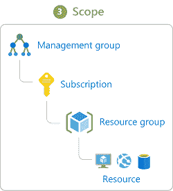

# 你得把特权分开

> 原文：<https://dev.to/azure/you-gotta-keep-privileges-separated-509>

曾经有过一个自动化的过程突然停止工作，即使你没有对过程做任何改变？没有什么比调试更令人兴奋的了，为什么没有人的提交被部署到生产环境中进行关键的修复，但一切都报告为“绿色”。当然，有些小事情是可以解决的，但那些事情在那一刻只是分心。每个人都对正在发生的事情有自己的看法，只希望现在就解决它！虽然我在运营团队中资历最老，但一些人认为是我缺乏专业知识导致了这个问题。那确实给了我一个找到问题的线索。有些事情已经改变了。建立 CD 管道的工程师最近已经离开了。经过一点侦查，我意识到他已经使用了他的凭证来让自动部署工作...所以当他离开的时候，他的证书失效了，它就这样无声无息地失效了。

> **没有天蓝色？** [抢免费订阅](https://azure.microsoft.com/en-us/free?&WT.mc_id=devto-blog-jedavis)。

当编写自动化脚本或构建服务时，不要在自己的凭证下运行。这为您的服务造成了单点故障。将不同环境之间的关注点分开也是一个很好的实践。这样即使有人不小心运行了针对生产的测试命令，也不会造成灾难性的后果。

一个推荐的方法是使用*服务主体*。Azure 服务主体是用于应用程序、服务和工具访问 Azure 资源的身份。通过使用服务主体，我们可以根据需要精确地分配特定的权限，以便在受到损害时将影响降至最低！

我们可以将不同的[内置角色](https://docs.microsoft.com/en-us/azure/role-based-access-control/built-in-roles)分配给一个服务主体，如果内置角色不够，还可以创建自定义角色。角色和服务主体之间没有一对一的关系。服务主体可以有多个角色。

在你[安装了 Azure CLI](https://docs.microsoft.com/en-us/cli/azure/install-azure-cli?WT.mc_id=devto-blog-jedavis&view=azure-cli-latest) 或者下载了 [docker 镜像](https://docs.microsoft.com/en-us/cli/azure/run-azure-cli-docker?WT.mc_id=devto-blog-jedavis&view=azure-cli-latest)之后，你就可以开始使用 CLI 了。我正在 docker 中运行这些例子。如果您已经直接安装，您可以忽略 docker 命令。

```
$ docker run -it microsoft/azure-cli 
```

Enter fullscreen mode Exit fullscreen mode

我们得到了 [*az* 命令](https://docs.microsoft.com/en-us/cli/azure/?WT.mc_id=devto-blog-jedavis&view=azure-cli-latest)，它有很多不同的功能。在本文中，我们将重点关注管理服务主体。首先，我们需要登录。

```
bash-4.4# az login 
```

Enter fullscreen mode Exit fullscreen mode

如果 CLI 可以访问 web 浏览器，它会打开浏览器并让您登录。否则，将从命令行提供一个要访问的 URL，以及一个要进入登录页面的代码。

根据您对 Azure 的使用情况，您可能会有不同的套餐。在 CLI 中运行命令之前，使用`az account list`检查您的订阅是有用的。我添加了`-o table`来让我更容易读取输出，而不是默认的 JSON 输出。这是我的输出的修改版本，显示我有两个帐户，一个是我在 Azure 免费帐户到期后升级的现收现付帐户，另一个是我的工作相关订阅。

```
bash-4.4# az account list -o table
Name                      CloudName    SubscriptionId                        State    IsDefault
------------------------  -----------  ------------------------------------  -------  -----------
my-pay-as-you-go          AzureCloud   00000000-0000-0000-0000-100000000000  Enabled  False
Visual Studio Enterprise  AzureCloud   00000000-0000-0000-0000-100000000001  Enabled  True 
```

Enter fullscreen mode Exit fullscreen mode

我想确保在这个演练中使用我的“Visual Studio Enterprise ”,所以我将显式设置我的订阅。

```
bash-4.4# az account set --subscription="00000000-0000-0000-0000-100000000001" 
```

Enter fullscreen mode Exit fullscreen mode

接下来，我想管理服务主体。通过添加一个 *-h* 标志，我可以在运行 Azure CLI 命令之前获得更多信息。

```
bash-4.4# az ad sp -h

Group
    az ad sp : Manage Azure Active Directory service principals for automation authentication.

Subgroups:
    credential      : Manage a service principals credentials.
    owner           : Manage service principal owners.

Commands:
    create          : Create a service principal.
    create-for-rbac : Create a service principal and configure its access to Azure resources.
    delete          : Delete a service principal and its role assignments.
    list            : List service principals.
    show            : Get the details of a service principal. 
```

Enter fullscreen mode Exit fullscreen mode

将它分解成几个部分，我使用的是`az` cli，带有用于活动目录的`ad`选项和用于服务主体的`sp`子选项。

我将使用主体名称为 SigjeServiceDemoPrincipal 的`create-for-rbac`选项，并将*读者*角色授予主体。如果在创建时没有指定角色，默认角色*贡献者*被分配给主体。 *Reader* 角色让主体查看所有资源，但不做任何更改。*贡献者*角色允许您管理除了更改资源访问之外的所有事情。角色分配可能会变得相当复杂。

```
bash-4.4# az ad sp create-for-rbac --name SigjeServiceDemoPrincipal --role Reader
Changing "SigjeServiceDemoPrincipal" to a valid URI of "http://SigjeServiceDemoPrincipal", which is the required format used for service principal names
{
  "appId": "00000000-1111-0000-0000-000000000000",
  "displayName": "SigjeServiceDemoPrincipal",
  "name": "http://SigjeServiceDemoPrincipal",
  "password": "My Sekret Password",
  "tenant": "11111111-0000-0000-0000-000000000000"
} 
```

Enter fullscreen mode Exit fullscreen mode

无需指定任何额外的内容，Azure 将为我的新服务主体生成并提供一个随机密码。

我们可以使用 appId 并使用它来检查我们刚刚创建的带有`az role assignment list --assignee --id "00000000-1111-0000-0000-000000000000"`的服务主体，它将使用一个 JSON 对象进行响应，该对象包含关于我们的服务主体的信息。

```
[  {  "canDelegate":  null,  "id":  "/subscriptions/00000000-0000-0000-0000-100000000001/providers/Microsoft.Authorization/roleAssignments/b681786a",  "name":  "b681786a",  "principalId":  "00000000-1111-0000-0000-000000000000",  "principalName":  "http://SigjeServiceDemoPrincipal",  "roleDefinitionId":  "/subscriptions/00000000-0000-0000-0000-100000000001/providers/Microsoft.Authorization/roleDefinitions/acdd72a7",  "roleDefinitionName":  "Reader",  "scope":  "/subscriptions/00000000-0000-0000-0000-100000000001",  "type":  "Microsoft.Authorization/roleAssignments"  }  ] 
```

Enter fullscreen mode Exit fullscreen mode

该角色分配的范围是针对整个订阅`"scope": "/subscriptions/00000000-0000-0000-0000-100000000001"`。范围是角色分配适用的级别。在这种情况下，它是订阅中的每个资源。

[](https://res.cloudinary.com/practicaldev/image/fetch/s--beJ4LTAN--/c_limit%2Cf_auto%2Cfl_progressive%2Cq_auto%2Cw_880/https://thepracticaldev.s3.amazonaws.com/i/x95a0y5ltc784wlgaigv.png)

在此图中，从上到下，我们从最大到最小的范围访问资源。

最后，我清理服务主体，因为我不想让这个服务主体在我的订阅中无所事事，`az ad sp delete --id "00000000-1111-0000-0000-000000000000"`会以*删除角色分配*作为响应。

## 接下来呢

理想情况下，我不会为自动化设置一个服务主体来使用密码进行身份验证，然后我会将密码嵌入到某个地方。相反，我们可以进行基于证书的认证，甚至将证书存储在 Azure Key Vault 中。我们还可以在创建时指定服务主体的范围，而不是在以后修改它，这样我们就可以限制服务主体对特定资源的访问。

分享你的不幸遭遇与个人证书或任何问题，你有以下！

资源:

*   [获取免费订阅](https://azure.microsoft.com/en-us/free?&WT.mc_id=devto-blog-jedavis)
*   [安装 Azure CLI](https://docs.microsoft.com/en-us/cli/azure/install-azure-cli?WT.mc_id=devto-blog-jedavis&view=azure-cli-latest)
*   [从 Docker 容器运行](https://docs.microsoft.com/en-us/cli/azure/run-azure-cli-docker?WT.mc_id=devto-blog-jedavis&view=azure-cli-latest)
*   [蓝色-cli 坞站](https://hub.docker.com/r/microsoft/azure-cli/dockerfile)
*   [Azure CLI deepdive](https://docs.microsoft.com/en-us/cli/azure/?WT.mc_id=devto-blog-jedavis&view=azure-cli-latest)
*   [使用 CLI 创建服务主体](https://docs.microsoft.com/en-us/cli/azure/create-an-azure-service-principal-azure-cli?WT.mc_id=devto-blog-jedavis&view=azure-cli-latest)
*   【Azure 资源的内置角色