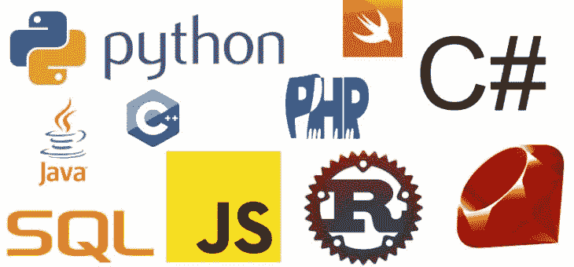

# 你真的想当学长？？

> 原文：<https://dev.to/christo_pr/you-really-want-to-be-a-senior-57g6>

几种编程语言。查看 2019 年 2 月 1 日，<[https://www . kkeducationsociety . org . in/WP-content/uploads/2018/10/Programming-language . png](https://www.kkeducationsociety.org.in/wp-content/uploads/2018/10/Programming-Language.png)>

# 要不要当学长？

现在有几种编程语言可以用于任何目的(web、分析、云计算、IA、ML 等)...)，但即使在这个每周都有数百万种新方法来解决同一个问题的大“时代”里，也有一些人为了捍卫自己解决问题的方法而相互争斗。

我们内心都有一个“憎恨者”，我们都喜欢用自己的方式解决问题(这就是为什么我们首先这么做)，但为什么我们要试图说服其他人我们的方式是最好的方式？仅仅因为它对我们有用？我认为这可能是非常自私的想法

在我短暂的职业生涯中，我认识到分享知识是让 T2 真正学到东西的最好方式。

我一直认为一个高级程序员就是这个神秘的人，在面带沉思地盯着屏幕 10 秒钟后总能找到解决方案的 stackoverflow-less，但是现在我明白了这个有价值的人的真正重要性(我的意思是除了所有神秘人的东西之外):**导师**

# 帮助和让自己帮助

一切都从最底层开始，我们都错过了`DELETE`陈述中的`WHERE`，我们都犯了同样愚蠢的错误，你现在称之为“noob”的人正在犯的错误，仅仅因为你现在理解了他们，并不意味着所有的人都会神奇地赶上。

有时候旁边有人问你关于项目的所有事情真的很烦人，但是嘿！如果 explain 花了你一些时间，试着理解，没有任何备份，一个已经有数千条记录和数百万行代码的项目？。相信我，在一天结束的时候，你会得到回报，你可以把工作委托给某人

# 师徒===耐心

当你理解它时，一切都变得容易，但你需要意识到，最重要的是，永远不要忘记做这件事需要你付出什么。每次一个人问你一些事情，是给你他的信任来帮助他解决他的误解，这对于一些人来说已经足够羞耻了，所以当你解释一些事情的时候没有必要粗鲁。

我知道有时候真的很难有耐心(我的意思是，在一天结束的时候，你是一个高年级学生，很明显你有非常重要的事情要做)，但帮助总是值得的，你必须找到一种方法(通常人们可以等待)来实现这一点。

# 什么是学长？

> 除了高级程序员的所有正常任务之外，他/她还必须帮助年轻人提高他们的水平

学长，什么是程序员？

*   **从业年限:**没有！老实说，我认为这不再是一个公平的衡量标准，我见过很多人虽然多年经验不足，但对自己正在做的事情有很深的了解，反之亦然

*   解决真正的硬错误:很可能有人已经遇到了你现在遇到的问题，所以只需要多挖掘一点来找到解决方案，尽管这是一种很棒的能力

*   不再使用谷歌:你的记忆力很好，但我们在这里谈论的是知识

*   **真的长胡子:**见鬼没有！虽然有时会有帮助(视觉上🤪)

都是关于**责任**的。

你需要明白，除了你自己，没有人对你自己的行为负责，如果你做了一个“快速修复”,在你的代码中引入了技术债务，当你每天在你的数据库中插入 10，000 行时，当你不得不重构它时，你要负责，当你没有向团队中的新成员解释如何设置项目时，当他开始将所有的意大利面条代码添加到回购中时，你也要负责。

一旦你开始更认真地对待这件事，你就会发现你做错了什么。

# 加油吧！！

我知道这一切听起来可能真的很令人不安，我们并不是为了教导人们，但这是一个双赢的局面，它实际上是可行的，你可以在任何地方看到这一切，社区，研讨会等...他们都有相同的理念:**分享和成长**

那么，你还想成为学长吗？

