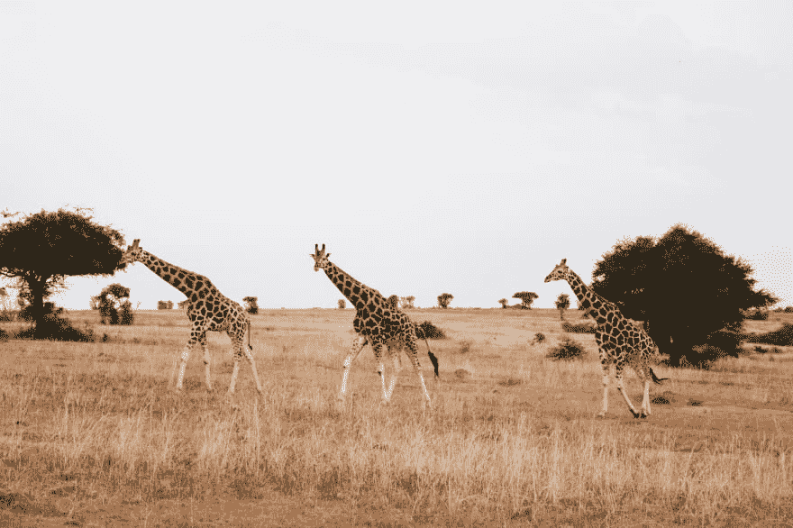
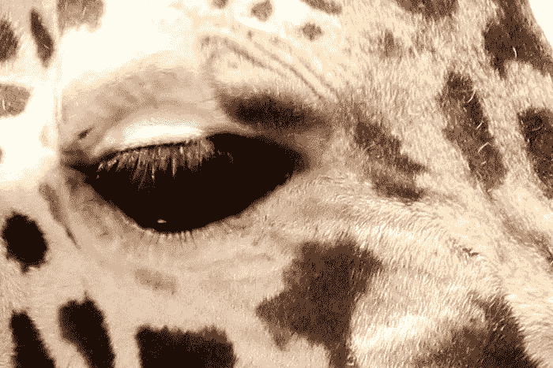
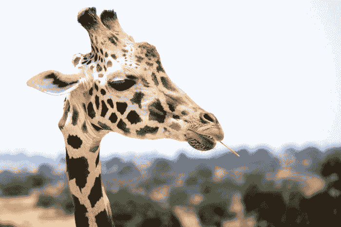
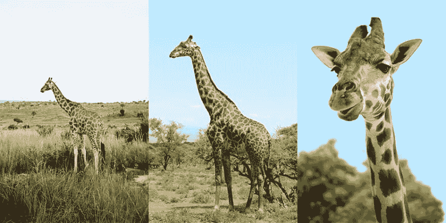
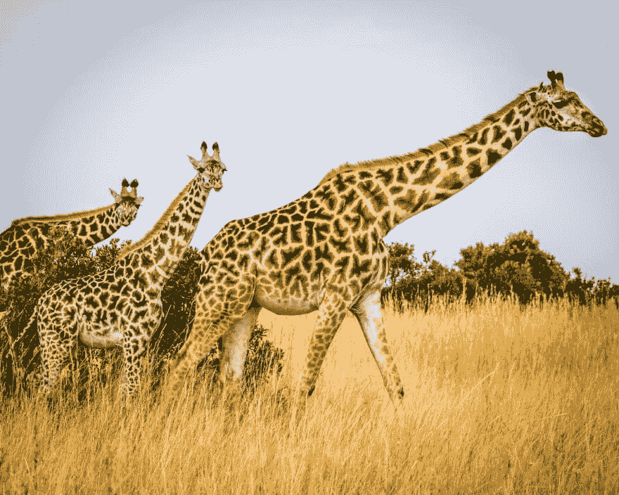

# 真正响应图像的完整指南

> 原文：<https://dev.to/dane_stevens/your-complete-guide-to-truly-responsive-images-3c8f>

[](https://res.cloudinary.com/practicaldev/image/fetch/s--njwIxD71--/c_limit%2Cf_auto%2Cfl_progressive%2Cq_auto%2Cw_880/https://cdn.tueri.io/274877906986/giraffe.jpg)

让一个网站具有响应性有很多因素，图片是一个主要因素，它可以决定你网站的成败。说完了，让我们开始吧:

```
 
```

[](https://res.cloudinary.com/practicaldev/image/fetch/s--A1XrTm_m--/c_limit%2Cf_auto%2Cfl_progressive%2Cq_auto%2Cw_880/https://cdn.tueri.io/274877906980/giraffe-NOT-responsive-image.jpg%3Fw%3D700%26crop.width%3D700%26h%3D467%26crop.height%3D467%26crop.x%3D1100%26crop.y%3D700)

哇哦。那不完全正确，让我们修正它。

## 使用 CSS 百分比宽度图片

根据定义，响应站点没有固定的宽度。我们可以通过使用百分比设置图像宽度来解决这个问题。可以使用内联 CSS 直接在图像上设置百分比宽度，也可以使用 CSS 样式表进行全局设置。

```
<!-- Inline CSS -->
 
```

```
/* Global CSS style sheet */
img {
    max-width: 100%;
} 
```

我们的图像设置为 100%最大宽度，现在看起来像这样。您可以随意调整浏览器窗口的大小，并看到图像宽度自动变化。

[](https://res.cloudinary.com/practicaldev/image/fetch/s--ITgyeYgh--/c_limit%2Cf_auto%2Cfl_progressive%2Cq_auto%2Cw_880/https://cdn.tueri.io/274877906980/giraffe-NOT-responsive-image.jpg%3Fw%3D700%26h%3D467)

厉害！我们的图像现在有反应了，但是不要太兴奋。CSS 百分比宽度有一个主要的缺点:这个阅读窗格的最大宽度是 700 像素，而我们的图像是 3742 像素宽，比我们需要的宽 532%。它还消耗了 1.55 MB 的带宽。

### 所以形象巨大，有什么了不起？

在标准的 ADSL 互联网连接上，下载一张图片需要 2 秒钟。

我假设你的网站上不止有一张图片。如果每张图片需要 2 秒钟下载，你的网站将会非常慢，你的搜索排名也会受到很大的影响。

### 如何修复这个问题？

因为我们只需要一个 700 像素宽的图像，让我们打开 Photoshop 并调整它的大小。

[](https://res.cloudinary.com/practicaldev/image/fetch/s--ITgyeYgh--/c_limit%2Cf_auto%2Cfl_progressive%2Cq_auto%2Cw_880/https://cdn.tueri.io/274877906980/giraffe-NOT-responsive-image.jpg%3Fw%3D700%26h%3D467)

那更好！我们的图像现在是 700 像素宽，264 KB 重，没有质量损失。

### 移动设备呢？

很棒的问题！在移动设备上，700 像素可能是你需要的两倍多，264 KB 在移动互联网连接上仍然很慢。

如果我们可以为不同尺寸的设备显示不同尺寸的图像会怎么样？

现在你在想了！

## 不同的图像尺寸使用 srcset 属性

让我们缩小我们的原始图像，并将其保存为 700 像素，480 像素和 360 像素的三个版本。我们将它们命名如下:

*   giraffe-small.jpg-360 像素@ 101 KB
*   giraffe-medium.jpg-480 像素@ 151 KB
*   giraffe-large.jpg-700 像素@ 264 KB

[](https://res.cloudinary.com/practicaldev/image/fetch/s--AaWtQfAP--/c_limit%2Cf_auto%2Cfl_progressive%2Cq_auto%2Cw_880/https://cdn.tueri.io/274877906987/small-medium-large-giraffe.jpg)

我们将使用 srcset 属性告诉浏览器我们不同的图像大小。这告诉浏览器我们有三个版本的图片，尺寸分别是 360 瓦、480 瓦和 700 瓦。这里的“w”和“px”是一样的。

```
 
```

一些旧的浏览器会忽略 srcset 属性。我们可以使用 src 属性作为这些浏览器的后备。

```
 
```

[](https://res.cloudinary.com/practicaldev/image/fetch/s--ITgyeYgh--/c_limit%2Cf_auto%2Cfl_progressive%2Cq_auto%2Cw_880/https://cdn.tueri.io/274877906980/giraffe-NOT-responsive-image.jpg%3Fw%3D700%26h%3D467)

太好了！现在，我们通过向不同的设备传送不同的图像来节省带宽。

这不言而喻，但你知道这意味着什么吧？你需要为你网站上的每张图片创建至少三个版本。如果你想支持高分辨率或视网膜显示器，你需要更多的变化。这是我们都没有的难以置信的时间。此外，如果你在不同的断点重新设计你的站点，你将需要从头再做一遍。

在 Tueri，我们也是开发人员，并认识到您的时间是宝贵的。在下一节中，我将向您展示我们是如何为您解决这个问题的。

## 用 [Tueri.io](https://tueri.io) 进行实时图像处理

[Tueri.io](https://tueri.io) 是一个实时图像处理平台。我们存储、处理您的图像，并以完美的尺寸将其发送到每台设备。

### 下面是你要做的

1.  将您的图像上传到 [Tueri.io](https://tueri.io)
2.  将图像`src`更改为`tueri-src`
3.  在你的代码中包含 [tueri.js](https://github.com/tueriapp/vanilla-tueri)

```

<script src="tueri.js"></script> 
```

[](https://res.cloudinary.com/practicaldev/image/fetch/s--l8NxDK8P--/c_limit%2Cf_auto%2Cfl_progressive%2Cq_auto%2Cw_880/https://cdn.tueri.io/274877906982/giraffe-family.jpg)

### 就像魔术一样！

哦，我们还做:

*   低质量图像占位符
*   图像延迟加载
*   图像压缩
*   图像转换

* * *

*最初发布于[tueri . io](https://tueri.io?utm_source=Dev.To&utm_medium=Post&utm_campaign=Responsive%20Images)T3】*