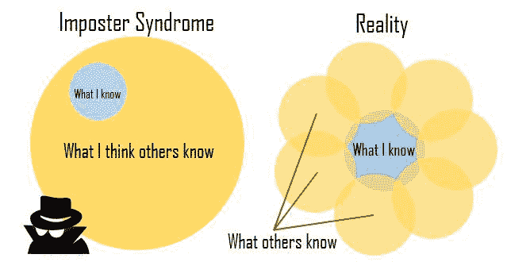

# 你不是骗子

> 原文：<https://dev.to/awwsmm/youre-not-an-impostor-1boi>

嘿*你*。是的， ***你*** ，读者。你点击这篇文章是因为你有某种程度的冒名顶替综合症。那种感觉，你认为你在某种程度上伪造了专业知识，以获得你在职业生涯中的地位，或者其他人都比你知道得多。你无助地挣扎着，希望没人会发现你是个骗子。

我有好消息。无论你的技能水平如何，无论你的职位如何，你都不是骗子。

* * *

> 我是 developer@ iamdevloper编程级数
> 
> 年份 0:我什么都不知道
> 年份 1-2:我知道一些事情
> 年份 3-4:我什么都不知道
> 年份 4-4.5:我什么都知道*
> 年份 4.5-10+:我什么都不知道

> "因为这是唯一的科学."* -苏格拉底悖论

苏格拉底悖论通常被解释为“我所知道的就是我一无所知”。一个人对一个主题了解得越多，他就越了解有多少东西需要学习。最简单的科目，背后都有几千年的历史；最复杂的问题需要学习数千年专家研究的总结和积累的知识。没有一样东西是你能完全学会的，即使你花了一生的时间去学习。总会有人知道一些你不知道的事，因为每个人的视角都不一样。

> 🅳🅰🆅🅸🅳🆆🅷🅸🆃🆃🅰🅺🅴🆁@ rundavidrun冒名顶替综合征:对自己知道的和已经做到的要诚实&少关注区别。2015 年 4 月 13 日下午 17:40

* * *

你之所以有今天，是因为你学会了一项困难的技能——如何给电脑编程。你可能在某个领域比其他程序员拥有更多的专业知识，你可能比比你编程时间更长的人懂得更少，但你绝对比一般人懂得更多。不要因为你不是流行框架的专家或者你还没有学会函数式编程语言而苦恼。矛盾的是，你足够清醒地认识到*患有*冒名顶替综合症，这一事实本身意味着你不应该认为自己是个冒名顶替者。你意识到自己知识的局限性。你知道你需要学习什么来保持竞争力，或者促进你的职业发展，或者在你的特定领域保持领先地位。

那些没有冒名顶替综合症的人是你要避免的。

[https://www.youtube.com/embed/3R5bPl1o5fk](https://www.youtube.com/embed/3R5bPl1o5fk)

* * *

*字面意思，[“他自己认为他知道一件事，他什么都不知道。”](https://en.wikipedia.org/wiki/I_know_that_I_know_nothing#cite_note-2)