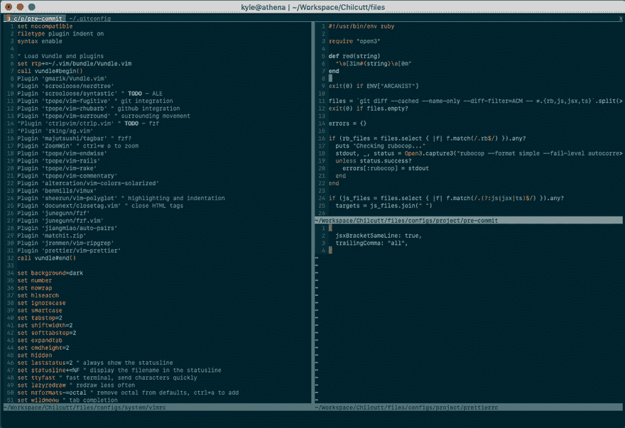

# 在 Vim 中缩放窗格

> 原文：<https://dev.to/chilcutt/zooming-a-pane-in-vim-dp8>

<figure>

<figcaption>Photo by [Paul Skorupskas](https://unsplash.com/photos/7KLa-xLbSXA?utm_source=unsplash&utm_medium=referral&utm_content=creditCopyText)on[Unsplash](https://unsplash.com/search/photos/lens?utm_source=unsplash&utm_medium=referral&utm_content=creditCopyText)</figcaption>

</figure>

当用 vim 编码时，我倾向于在工作流中大量使用分割窗格和选项卡。并排打开不同的文件有助于我跟踪代码，确定哪里需要修改。

一旦我找到我想要编辑的地方，我通常会将我的焦点转移到一个文件上。这就是一个叫做 ZoomWin 的方便的小插件的用武之地。安装了 ZoomWin 包后，我可以用`<c-w> o`切换缩放窗格(control + w，然后是 o)。

